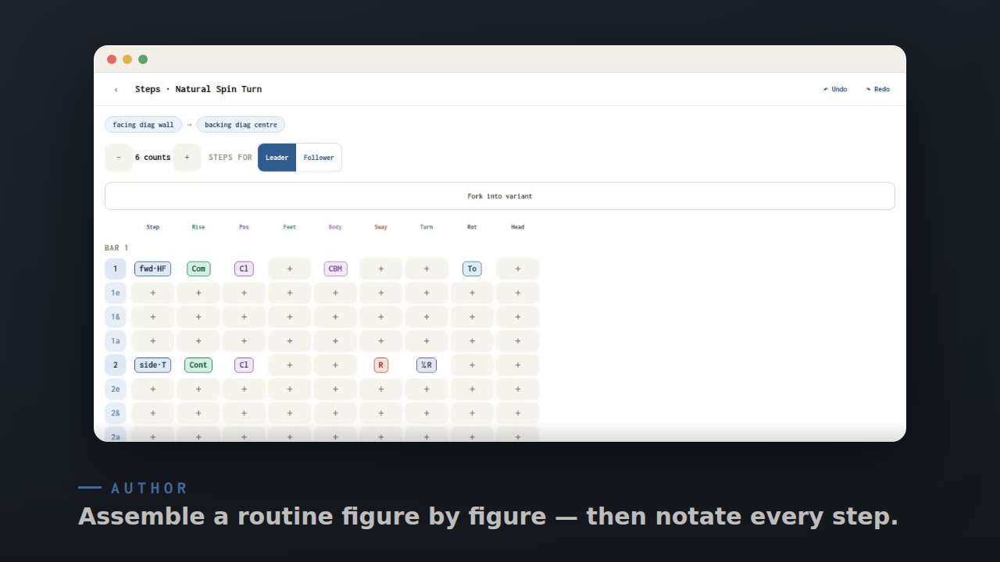

# Weave Steps

A collaborative, **mobile-first PWA for building and annotating ballroom dance choreography**.

A *routine* is an ordered sequence of **figures**, each described as a timeline of
**attributes** (footwork, sway, turn, rise, position, …) placed at relative counts.
Figures are **reusable and forkable**: there's an application-wide global library of
canonical figures plus your own account variants, a routine *references* figures, and
refining one of your figures flows into every routine that uses it. You can fork a whole
routine ("make it your own") or fork a figure into a variant that inherits its base and
stores only your overrides. People **annotate** routines — corrections, lessons, practice
notes — anchored to a count, a figure, or a whole cross-dance figure *family*.

It's built on a **CRDT document graph** (Automerge) so collaboration, offline-capability,
and forking are first-class rather than retrofitted.

## See it in action

An **auto-generated** product tour — a slow, hand-held walkthrough of one real
authoring journey (create → build → notate → annotation reference → overview → note
→ share), recorded straight from the running app so it never goes stale. Click to play:

<a href="apps/web/src/marketing/video/explainer.mp4">
  
</a>

> ▶ **[Watch the tour](apps/web/src/marketing/video/explainer.mp4)** — regenerate it any
> time with `pnpm video:generate` (records the clips via Playwright, then renders the MP4
> with Remotion). See [`docs/TOOLING.md`](docs/TOOLING.md#explainer-video).

## Goals & constraints

- **Collaborative & local-first** — concurrent editing merges cleanly; fork/inheritance is the v1 centerpiece.
- **Mobile-first PWA** — installable; performant on phones; desktop also looks good.
- **Cloudflare end-to-end** — Workers + Durable Objects (one Automerge doc per document) + D1 index.
- **Managed auth** — Clerk (no self-run auth).
- **Cheap** — runs on Workers Paid (~$5/mo); a future pro plan monetizes a free quota.
- **Quality & maintainability over feature count** — YAGNI, except the deliberate fork / document-graph investment.

## Tech stack

| Layer | Choice |
|---|---|
| Client | React 19 + Vite PWA, Tailwind v4 design system, TanStack Query, Clerk |
| Data | Automerge CRDT document graph behind a `store/` seam |
| Backend | Cloudflare Worker (Hono) + per-document SQLite-backed Durable Objects |
| Index | D1 (Drizzle) — registry/search only; no CRDT content |
| Contract | Zod + Hono RPC types (`packages/contract`) |
| Tooling | pnpm workspaces, Biome, Vitest (+ `vitest-pool-workers`), Playwright, lefthook |

## Quick start

```bash
pnpm install          # Node 22 (see .nvmrc)
pnpm dev              # runs web (Vite) + worker (wrangler dev) together
pnpm test             # all unit/property/component suites
pnpm test:e2e         # Playwright (chromium-desktop, mobile-chrome, mobile-safari)
pnpm lint             # Biome
pnpm typecheck        # tsc across all workspaces
```

To run/deploy for real you need Clerk + Cloudflare accounts — see [`PROVISIONING.md`](PROVISIONING.md).
Pure domain development (Milestone 1) needs no external accounts.

## Repository layout

```
packages/domain/    pure TS domain logic (Automerge doc schemas, overlay, fork, undo, registry, timing)
packages/contract/  Zod schemas + Hono RPC types shared by web & worker
apps/worker/        Hono Worker + per-document Durable Object + D1 index
apps/web/           React PWA: design system (src/ui), store seam, screens
docs/               PLAN.md (current-state spec) + proposals/ (WEP change process) + design, tooling, testing
research/           deep-dive research behind the plan's decisions
```

## Where to read more

- **[`docs/PLAN.md`](docs/PLAN.md)** — the single source of truth for current state (domain model, architecture, milestones, locked decisions).
- **[`docs/proposals/`](docs/proposals/README.md)** — the change process: KEP-style **Weave Enhancement Proposals** (WEPs) with statuses, ship gates, and the rejected-alternatives record.
- **[`CLAUDE.md`](CLAUDE.md)** — the working guide that routes contributors (human or agent) to the right doc for their task.

> **Status:** the **M0–M9 v1 roadmap is complete end-to-end** (PLAN §9 close-outs, 2026-07-03; v5 live-figure migration 2026-07-02; offline editing 2026-07-05; Builder-v3 model changes 2026-07-07) and staging is live. New work is scoped through the [WEP index](docs/proposals/README.md).
