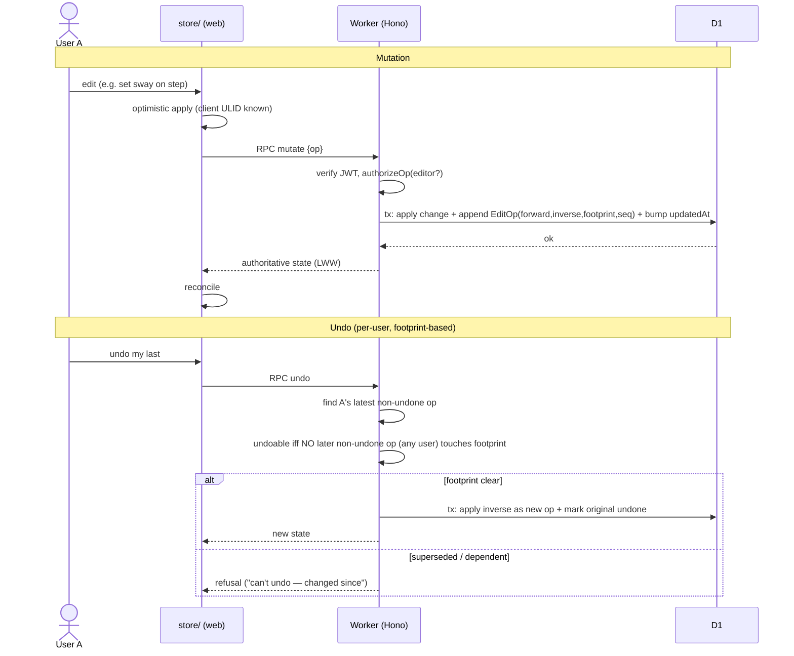

# Ballroom Flow — Master Plan

**Status:** Draft for review — consolidated v1
**Date:** 2026-06-25

This is the single source of truth for Ballroom Flow. It consolidates four working documents into one coherent plan:

- the **design specification** (v3) — what we are building and why;
- the **implementation plan** — the buildable, milestone-by-milestone decomposition;
- the **testing plan** — the detailed, layered quality strategy (an explicit owner requirement);
- the **open questions** — the live list of decisions still needed.

The wireframe prototype (`docs/design/Ballroom Builder.dc.html`) is the **product sketch** these documents synthesize — a source of feature inventory, not a requirements list. Earlier research sources (`research/*.md`) are cited where a decision traces back to them.

**Guiding principle:** *quality and maintainability over feature count.* Every feature is sorted v1 / v1.1 / out-of-scope and YAGNI is applied ruthlessly.

---

## Table of contents

1. [Overview & Goals](#1-overview--goals)
2. [Domain Model](#2-domain-model)
3. [Controlled Vocabularies — the SLOT_REGISTRY](#3-controlled-vocabularies--the-slot_registry)
4. [Features by Screen](#4-features-by-screen)
5. [Collaboration, Permissions & Undo](#5-collaboration-permissions--undo)
6. [Architecture](#6-architecture)
7. [Non-Functional Requirements](#7-non-functional-requirements)
8. [Locked Technical Decisions](#8-locked-technical-decisions)
9. [Implementation Roadmap (Milestones)](#9-implementation-roadmap-milestones)
10. [Testing Strategy](#10-testing-strategy)
11. [Out of Scope (v1)](#11-out-of-scope-v1)
12. [Open Questions & Decisions Needed](#12-open-questions--decisions-needed)
13. [Appendix: Media (v1.1)](#13-appendix-media-v11)

---

## 1. Overview & Goals

### 1.1 What it is

Ballroom Flow is a **collaborative, mobile-first PWA** for building and annotating ballroom dance choreography ("routines"). A routine is an ordered sequence of **figures** (named standardized movement patterns), each holding **two step charts** (leader + follower); every step is annotated across technique dimensions (rise & fall, body, footwork, sway, turn). Routines are organized into **sides** (Long / Short / Corner) that mirror the rectangular competition floor. Partners and a coach **discuss** the routine through per-step comment threads and a per-user **journal** of lessons and practice notes that link back into the choreography.

### 1.2 Who uses it

- **A couple** (a leader and a follower) building and practising one routine together — both can edit it.
- **An optional coach** who reviews and comments (view + comment).

Typical sharing graph: 2–3 people per routine. A small-N collaboration tool, not a social network or studio LMS.

### 1.3 Non-negotiable constraints (owner)

1. **Cloudflare-hosted** end to end.
2. **No self-run auth** — managed identity provider with a generous free tier.
3. **Cheap** — ~$0/month at hobby scale; usage-based beyond.
4. **Performant** on mobile.
5. **PWA is the priority** (installable; no native app in v1).
6. **Quality & maintainability over feature count** — apply YAGNI.
7. **A solid, detailed testing plan is required** (§10).

> **Note on offline:** v1 is **online-only**. Offline-first was an earlier goal but is deferred; the next planned increment is offline *read* (cache the last-opened routines for read-only viewing). The architecture keeps the door open for it (§6) but builds none of it now.

### 1.4 Primary user journey (the core loop)

1. Sign in (Clerk).
2. Open the **sample routine**, start from a **template**, or create a routine for a dance.
3. Add sides → add figures from the library (or compose custom) → the figure arrives with leader+follower step charts.
4. Open a figure, **tag each step's technique slots** (the hero flow) — per row in Step Detail, or fast across all steps in **Lanes view**.
5. Discuss specific steps in threads; record lessons/practice in the journal, linked to a step or a figure.
6. **Undo** any of your own changes at per-action grain.

### 1.5 How we got here (decision history)

Two review passes shaped the current design and are worth keeping for traceability:

- **v2 — radical simplification (online-only).** The owner (a dancer) locked decisions that deleted the entire sync-correctness surface: **no CRDT, no Durable Objects, no WebSockets, no two-zone write-authority, no fork-to-edit.** v1 is online-only and server-authoritative with last-write-wins. Both partners co-edit ONE routine; the coach views + comments. Undo became a required v1 feature, made cheap by online-only via a per-routine server-side op-log. Domain answers landed here too: **two step charts per figure**, **per-figure alignment**, **meter-based timing**, **body = position + body-action**, confirmed enum additions, and the structured per-step tagging as the v1 hero flow.
- **v3 — extensibility seams (cheap now, expensive later).** Three extensibility reviews (`research/extensibility-{attributes,crdt,undo}.md`) folded in foundations that let the planned increments (offline read, CRDT sync, new op kinds) land without migrations. The unifying insight: **the op-log, shaped correctly, serves undo today AND the future CRDT AND new op kinds — one mechanism, not three.** Concretely: client-generated ULID ids; soft-delete tombstones; a widened op-log (HLC clock + server `seq` + structured forward/inverse diffs + footprint + op registry); a single `SLOT_REGISTRY` vocabulary source of truth (retiring `hasRiseFall`); `schemaVersion` on the export envelope and Routine row; and a `store/` client repository seam. **YAGNI still holds: reserved seams are documented, not built.**

**Net effect:** a smaller, sharper v1. The biggest original risk areas (sync/merge, fork) are deleted; the new highest-risk areas are **undo/op-log correctness, two-chart data integrity, and Worker-side permission enforcement** (§10).

---

## 2. Domain Model

### 2.1 Conventions applying to every entity

Everything lives in **D1** (single relational source of truth); static reference data (dance metadata, figure catalog, technique vocabularies) ships **in the client bundle**.

- **Client-generated IDs.** Every `id` is a client-generated, globally-unique, sortable identifier (**ULID** or **UUIDv7**), stored as a **TEXT primary key** in D1 — **no autoincrement**. The client knows an entity's id before the server does, which makes v1 optimistic-create unambiguous (no id reconciliation round-trip) and is the prerequisite for future offline creation.
- **Soft-delete / tombstones.** Deletable entities (Routine, Side, Figure, Step, Thread, Comment, JournalEntry, Link, Membership) carry a nullable **`deletedAt`**. A v1 delete **sets `deletedAt`** (filtered out of normal queries) — **never a bare row-drop**. This makes delete reversible (inverse = flip `deletedAt` back to null, §5.4), so cascade-undo restores a whole subtree with original ids and nothing dangles, and it is the remove-wins tombstone a future CRDT requires.

### 2.2 Canonical entities

#### User
- `id` (internal, mapped from Clerk `sub`), `displayName`, `defaultRole` (`leader` | `follower` | `coach`), `identityColor` (hex, user-chosen, **global across all their routines** — attributes their notes consistently).

#### Routine
- `id`, `title`, `dance` (enum, §3.6), `createdAt`, `updatedAt`, `createdByUserId`, `templateOf` (nullable — marks the read-only sample/templates), `copiedFromRoutineId` (nullable — provenance for "save a copy"; no live link), **`schemaVersion`** (int — the data-model version this routine was written under; the planned offline-read cache and import/migration ladder key on it, §7).
- Derived: `barsPerRole` (meter-based: **`bars = ceil(maxBeat / beatsPerBar)` per role**, where `maxBeat` is the highest beat used in that role's chart; a partial/incomplete final bar displays as-is, §3).
- `dance`-derived display color.
- **Owns** an ordered list of Sides.

#### Side
- `id`, `routineId`, `kind` (`long` | `short` | `corner`), `sortKey` (fractional index for stable order), `deletedAt`.
- **Owns** an ordered list of Figures.
- **The ordinal display name is computed, not stored.** "1st Long Side", "Corner 2", etc. is derived from the side's position among same-`kind` sides in current order, so deleting a side **renumbers** the rest automatically (renumber-from-order rule).
- Sides apply to **travelling** dances (all v1 dances are travelling). The `travelling` flag lives on dance metadata for forward-compat; a future spot dance could use a single implicit side. Not built in v1.

#### Figure
- `id`, `sideId`, `name`, `source` (`library` | `custom`), `libraryFigureId` (nullable), `sortKey`, `deletedAt`.
- **Alignment (per-figure):** `entryAlignment` and `exitAlignment`, each a pair `{ qualifier: facing | backing | pointing, direction: LOD | ALOD | wall | centre | DW | DC | DW_against | DC_against }` (ISTD-style; §3.8). Nullable (optional to fill).
- **Owns TWO ordered step lists:** `leaderSteps[]` and `followerSteps[]`.
- Derived: `isCustom`, per-step `threadCount` (per role).
- **Position forward-compat:** a figure's position is the pair `(sideId, sortKey)`. v1 only reorders *within* a side. If cross-parent move is ever added, write position as a **single atomic value** so a move can't half-apply. `sortKey` keys append the creating **actor's id as a tiebreak**; v1 uses a generous key space and **never rebalances**.

##### KEY MODEL DECISION (LOCKED) — two step charts per figure
Every figure holds **two independent, authoritative step charts**, one per role. They are **not necessarily 1:1**: the follower may have steps the leader does not (e.g. a heel turn) and vice versa. Each chart is its own ordered list of Steps with its own counts, footwork, sway, turn, etc.

**Authoring UX (locked):** each person defaults to viewing **their own role's** chart. During entry, both charts are shown side-by-side and the follower's values are **pre-filled equal to the leader's**, then the user edits the differences. Pre-fill is a one-time seeding convenience at step-creation, **not a live binding** — once seeded the two charts are independent.

#### Step
- `id`, `figureId`, **`role` (`leader` | `follower`)**, `sortKey`, `action` (free text, e.g. "LF forward"), `timing` (see below), `deletedAt`, and the **core technique slots** as **typed Drizzle columns** (hybrid storage, not EAV): `rise`, `body` (position) + `bodyActions` (CBM/CBMP set), `foot`, `sway`, `turn` — all nullable. Their keys, cardinality, allowed values, and dance/role applicability come from the **SLOT_REGISTRY** (`domain/vocabulary.ts`, §3), the single source of truth.
- **Reserved (not built) extensibility seam:** a documented `stepAttributes(stepId, slotKey, value)` side table for *future non-core* slots (e.g. per-step alignment, Lead) so they can land **without a Step migration**. v1 builds none of it. Registry entries mark `storage: "column"` (the core 5) vs `storage: "attribute"` (future).
- Derived: `n` (1-based index within its role's chart).
- **`timing` (meter-based):** `{ beat: number, sub?: "e" | "&" | "a", value?: beatValue }` where `beat` is the continuous position within a two-bar phrase (1–6 for 3/4 dances, 1–8 for 4/4), `sub` is an optional subdivision marker, and `value` is the optional beat-value the step occupies (e.g. S = 2 beats, Q = 1). **Bars derive from the dance's meter:** for a 3/4 dance a bar = 3 beats (beats 1–3 = bar 1, 4–6 = bar 2); for 4/4, 1–4 / 5–8. Derivation runs **per role**. *(Owner-confirmed — locked.)*
- **Turn** is a property of the step (the amount of turn on/into this step); no separate feet-vs-body amount in v1.

#### Thread + Comment
- **Thread**: `id`, `routineId`, `anchor`, `deletedAt`, ordered Comments. **Anchor (role-aware):** `{ type: "step", figureId, role, stepId }`. Threads attach to a step **in a specific role's chart**. A figure-level thread is not modeled in v1 (figure-level discussion goes in the journal via figure links).
- **Comment**: `id`, `threadId`, `authorId`, `createdAt`, `text`, `deletedAt`. (No separate `targetRole` — the anchor carries the role.)
- Comments are **shared and visible to all members** of the routine.

#### Journal Entry
- `id`, `authorId`, `routineId`, `kind` (`lesson` | `practice`), `who` (free label: "Anna", "solo", "w/ Lena"), `createdAt`, `text`, `links[]` (see Link), `tags[]` (free-text themes), `media[]` (v1.1; §13), `deletedAt`.
- Per-user, **visible to co-members** of the routine it links to. Authorship/color via `identityColor`.
- A v1 journal entry links **within a single routine** (keeps queries simple).

#### Link (trimmed)
v1 supports exactly two anchor shapes, both routine-scoped:
- `{ type: "step", figureId, role, stepId }` — a specific step in a role's chart.
- `{ type: "figure", figureId }` — a whole figure (all roles, all steps).

The wireframe's 9-cell polymorphic model (attribute anchors × dance/global scopes) is **dropped** (§11). The two shapes cover the validated need; more is YAGNI.

#### Membership (sharing / ACL)
- `routineId`, `userId`, `role` (`editor` | `coach`), `createdAt`, `deletedAt`.
- **`editor`** = full co-edit (both partners). **`coach`** = view + comment. There is no single "owner" gate; the routine creator is an editor like the other partner. (Whether a coach may edit *tags* specifically → **Q-D6**, default comment-only.)
- Routine deletion / member removal is restricted to editors.

#### EditOp (op-log — undo today, the CRDT seam tomorrow)
Shaped once to serve **three** consumers: v1 undo, the future CRDT sync engine, and any new op kind. Fields:
- `id` (client ULID), `routineId`, `actorId`, **`clock`** (Lamport / hybrid-logical clock for causal ordering — the future CRDT merge seam), **`seq`** (server-assigned monotonic-per-routine projection — the **ordering authority in v1**, *not* identity), `createdAt`, `kind`, `forward`, `inverse`, **`footprint`**, `undone` (bool).
- **`forward`/`inverse` are structured, self-describing diffs** — `{ entityType, id, field, before, after }` (or a small list for compound ops) — **not opaque blobs**. This is what lets undo, audit, and a future merge all read an op without bespoke code per kind.
- **`footprint`** = the set of entities the op touched, each with its `versionBefore`. It is what the unified undoability rule (§5.4) checks.
- **Op registry:** each op `kind` is one entry describing how to apply, invert, and compute the footprint. **New op kinds add a registry entry and touch nothing in the undo machinery.**
- **Retention contract:** the op-log is **NOT the source of current state** — the D1 entity rows are. There is **no replay-on-load**; reads hit the rows directly. The log exists for undo/redo and future sync. **Snapshot/prune** of old ops is a planning detail, safe precisely because state never depends on replaying the log.
- Appended on **every** structural/tag/delete mutation, in the same transaction.

### 2.3 Entity-relationship summary

```
User 1──* Membership *──1 Routine 1──* Side 1──* Figure
                                  │                  ├── leaderSteps[]   1──* Step(role=leader)
                                  │                  └── followerSteps[] 1──* Step(role=follower)
                                  │                                            │
                                  │                            Thread(anchor: figureId+role+stepId) 1──* Comment
                                  ├──* JournalEntry *──* Link ──▶ {step in a role chart | figure}
                                  └──* EditOp (append-only op-log, per-user undo)

LibraryFigure (static reference, per Dance; carries default leader+follower charts) ──▶ instantiated into Figure
```

Full field-level schema (Drizzle table shapes, FK graph, JSON column contents) is given as the M2 data model in §9.

### 2.4 Storage placement
**Everything is in D1** (Drizzle-typed). No Durable Object, no separate live store. The routine list is a plain indexed D1 query; a routine's full tree (sides → figures → both step charts → threads/comments + its journal entries) is loaded via Hono RPC. Static reference data (dance metadata, figure catalog with default charts, technique vocabularies) ships in the client bundle, versioned by `schemaVersion`.

---

## 3. Controlled Vocabularies — the SLOT_REGISTRY

### 3.0 The single source of truth
All technique-slot vocabulary lives in **one** module, `packages/domain/src/vocabulary.ts`, the **SLOT_REGISTRY**. Each entry:

```
{ key, label, color, cardinality: "single" | "multi",
  values: [{ value, label, aliases?: [...], confirm?: true }],
  appliesToDances: [...],   // omit a dance to hide the slot for it
  appliesToRoles:  [...],   // both roles by default
  storage: "column" | "attribute" }   // core 5 = column; future = attribute
```

The **tag editor, Lanes view, Info-sheet glossary, chips, and Zod validation all DERIVE from this registry** — there is no separately-maintained glossary to hand-reconcile. Two forward-compat behaviors are baked in:
- **`appliesToDances` retires `hasRiseFall`.** Tango simply isn't in rise's `appliesToDances`, so the rise slot is absent for Tango with no special-case boolean.
- **Forward-compatible reads.** The registry carries a **version** and per-value **aliases**; an unknown enum value **passes through rather than hard-failing** on read, and known aliases normalize (e.g. **`CBP` → `CBMP`**). Validation rejects only on *write* of an unknown value, not on read.

Values still needing a dancer/coach are marked **[confirm]**.

### 3.1 Rise & Fall (`rise`) — color `#1f8a5b`
Canonical values (7): `commence`, `body_rise`, `foot_rise`, `up`, `continue`, `lowering`, **`NFR`** (no foot rise — owner-confirmed). **Tango suppresses this slot entirely** via `appliesToDances` (no `hasRiseFall` boolean). `body lower` remains **[confirm]** (rare).

### 3.2 Body — position + body-action (`body` / `bodyActions`) — color `#8a5cab`
Modeled as **two independent fields** (owner: flexible, pending coach):
- **Position** (single-select): `closed`, `promenade` (display "Promenade (PP)"), `wing`. **[confirm]** completeness.
- **Body-action** (multi-select, possibly empty): `CBM` (body action), `CBMP` (foot position). The wireframe's **"CBP" is treated as a suspected typo for CBMP** — **[confirm] (Q-D4)**.

### 3.3 Footwork (`foot`) — color `#a9742c`
Canonical values (5): `HT`, `T`, `TH`, `heel_pull`, **`H`** (bare Heel — owner-confirmed). Broader set (`B`, `F`/`WF`, `BH`, `IE`/`OE`) is **[confirm]/deferred**.

### 3.4 Sway (`sway`) — color `#c0563f`
Canonical values (3): `to_L`, `to_R`, `none`. Stable.

### 3.5 Turn (`turn`) — color `#5b6b8a`
Canonical values (8): **`eighth_L` (⅛, 45°)** + **`eighth_R`** (owner-confirmed), `quarter_L` (¼), `quarter_R`, `three_eighth_L` (⅜), `three_eighth_R`, `half_L` (½), `half_R`, `none`. Finer magnitudes (⅝, ¾) are **[confirm]/deferred**.

### 3.6 Dance (`dance`)
v1 ships **International Standard / Smooth (travelling) only**: `waltz`, `viennese_waltz`, `quickstep`, `foxtrot`, `tango`. Each carries metadata: display color (Waltz blue, Quickstep green, Foxtrot purple, Tango red, Viennese blue-gray), `timeSignature`, `beatsPerBar` (3 for Waltz/Viennese; 4 for Foxtrot/Quickstep/Tango), `phraseBeats` (6 or 8), `travelling: true`. (Which slots apply to which dance lives in the SLOT_REGISTRY `appliesToDances`, not on the dance record.) Latin/spot dances → v1.1; the `travelling` flag is present so they slot in without a migration.

### 3.7 Small fixed enums
- Side kind: `long` | `short` | `corner`.
- Membership role: `editor` | `coach`.
- Step role: `leader` | `follower`.

### 3.8 Alignment (per-figure)
Each Figure carries optional `entryAlignment` and `exitAlignment`, a pair:
- **Qualifier:** `facing` | `backing` | `pointing`.
- **Direction:** `LOD` | `ALOD` | `wall` | `centre` | `DW` | `DC` | `DW_against` | `DC_against`.

Reads e.g. "Facing Diagonal to Wall". The owner placed alignment at **figure** grain (entry + exit) rather than per-step for v1. Per-step alignment is deferred.

---

## 4. Features by Screen

Each screen is scaled to complexity; **v1** vs **deferred** marked. Items the wireframe stubs/omits but a real app needs are called out.

### 4.0 Cross-cutting (wireframe omits; v1 must design)
| Capability | Wireframe state | v1 decision |
|---|---|---|
| Auth / onboarding | absent | **v1.** Clerk hosted sign-in (Google + passkeys). Onboarding: displayName, default role, identity color. |
| Account / settings | absent | **v1 minimal.** Edit displayName/role/color; sign out. No theme settings. |
| Delete flows | absent | **v1** for routine, side, figure, step, journal entry; comment delete = author-only. Confirm dialogs. |
| Reorder UX | append-only | **v1** — figures and steps reorderable within their parent (within a role's chart) via `sortKey`. Side reorder deferred. |
| Step add/edit/remove | only whole-figure add | **v1** — add/edit/remove steps within a figure's chart, edit timing/action. Core authoring. |
| **Undo** | absent | **v1 required** — per-user, per-action (§5.4). |
| Search | absent | **v1** routine-list search by title/dance (indexed D1). Journal search deferred. |
| Invite | toast only | **v1** invite by link (signed token → Membership). Email invite deferred. |
| "Duplicate" | toast only | **v1** = save-a-copy (deep copy, provenance only; §5.3). Not an edit mechanism. |
| Media | "coming soon" | **v1.1** (§13); model carries `media[]`, UI shows "coming soon". |
| Sample/template | n/a | **v1** read-only sample routine + start-from-template. |
| Export/import | n/a | **v1** JSON export AND import (§7). |

### 4.1 Routine List (`scList`) — Choreo tab, default
List routines the user is a member of (indexed D1 query). Card: dance-color icon, title, `dance · barLabel · created`, chevron. Tap → Assemble. "+" → New Choreo sheet. **Empty state:** sample routine + "start from template". Title/dance search.

### 4.2 Assemble (`scAssemble`) — routine overview
Sides → figures view; collapsible side headers with derived bar labels; figure cards (name, custom badge, count summary, **entry/exit alignment** chips, tap → Figure Timeline). "Add figure" → Add-figure sheet; "add side" → inline Long/Short/Corner picker (auto-naming). Reorder/delete figures within a side. Share button → Share. **Role toggle** (leader/follower) sets which chart's summary chips show; defaults to the viewer's own role.
- **Edit access:** any `editor` member edits freely. A `coach` sees read + comment affordances only. Reading-vs-editing as separate modes is collapsed — the only gate is the membership role.

### 4.3 Figure Timeline (`scFigure`)
- **Step list:** rows per step (timing, action, thread badge, the five slot chips, expand). Tapping a row opens Step Detail. **Add/remove step, edit timing/action.** **Role view** (leader | follower | **both side-by-side**); "both" is the pre-filled side-by-side entry mode.
- **Lanes view (v1):** one technique dimension across all steps at once — the fast cross-step tagging surface. Per role. Lanes derive from the SLOT_REGISTRY.
- **Alignment:** edit the figure's entry/exit alignment here.

### 4.4 Step Detail + Tag Editor (`scStep`) — the hero flow
"Tag · step N (leader|follower)"; step card (timing, action, figure name, thread button → thread). Slot sections are **rendered from the SLOT_REGISTRY** — which slots appear (Rise absent for Tango), their values, single- vs multi-select (chips) all derive from the registry, not hardcoded UI. Re-tapping clears. Edit timing/action. Optimized for speed (large touch targets, minimal taps, keyboard-free).

### 4.5 Thread (`scThread`)
Per-step thread (role-aware anchor); people legend; comments with author-color border, "Name (role) · time", text; reply bar. Comment delete (author-only). Any member (editor or coach) may post. Deferred: comment editing, read/unread, notifications, threading depth.

### 4.6 Share (`scShare`)
Member list (name, role: editor/coach). Invite by link (signed token; inviter picks editor/coach). Remove a member (editor-only). "Duplicate" button → save-a-copy (§5.3). Explanatory card: *"Both partners can edit this routine together. Coaches can view and comment. Notes are shared with everyone on the routine."* Deferred: transfer/ownership concepts, per-member fine-grained access.

### 4.7 Journal List (`scJournal`) — Journal tab
Entries (author avatar, "Kind · who", date, text, tag chips). Tap → editor. "+ entry". Functional filter chips **all / lessons / practice** (client filter). **`by figure` filter is v1**. Empty state. Journal search deferred.

### 4.8 Entry Editor (`scEntry`)
Author row; textarea; LINKED TO list with add/remove; save. **Link picker supports step links AND figure links** (4.9). Media row (voice/photo/video) → "coming soon" (v1.1).

### 4.9 Link Picker (`lpOpen`)
Two paths — (a) **step:** side → figure → **role** → step; (b) **figure:** side → figure. Scope is implicitly the current routine. The attribute anchors and dance/global scopes are dropped (§11).

### 4.10 Profile (`scProfile`) — Profile tab
Identity (avatar, name, role); **editable** name and default role; note-color picker with live preview ("Each member picks their own colour; consistent across every routine"). Sign out. Compute the shared-routine count (no hard-coded literal). Deferred: themes/backdrop.

### 4.11 Overlays
- **Add-figure sheet (v1):** dance-filtered library list, filter input, "+" to add (instantiates the figure with its catalog default **leader + follower** charts, or a generic placeholder for custom). Empty state. "Create my own figure" → compose (name + placeholder steps for both roles).
- **New Choreo sheet (v1):** 5 Standard dance chips, name input, create → Assemble. Plus "start from template".
- **Info sheet (v1-lite):** per-slot name + value list **read from the SLOT_REGISTRY** — never a separately-maintained glossary; terse copy. Full teaching glossary deferred.
- **Toast (v1):** transient confirmations, including **"Undone"** with the action name.

---

## 5. Collaboration, Permissions & Undo

### 5.1 Rules
1. **Both partners co-edit ONE routine.** No owner-only structure, no fork-to-edit. Editing is shared among `editor` members.
2. **Notes/comments are shared and visible** to all members.
3. **Coaches view + comment**, do not edit structure/figures/steps (tag-edit by coach is **Q-D6**, default no).
4. **Identity color is per-user and global**, attributing every note consistently.

### 5.2 Roles & access
| Role | Can do |
|---|---|
| `editor` (both partners) | Create/edit/delete sides, figures, steps, tags, alignment; comment; journal; invite/remove members; delete routine; undo own actions. |
| `coach` | View everything; comment; journal; (tag-edit: default no — Q-D6). |

No single owner gate. Member removal and routine deletion require `editor`.

### 5.3 "Duplicate" = save a copy (not an edit path)
- Deep copy of the routine (sides, figures, **both charts**, tags, alignment) into a new routine; `copiedFromRoutineId` set for provenance only. The copier becomes an `editor` of the new routine.
- Comments/threads and journal entries are **not** copied (fresh artifact). **[confirm] Q-D5.**
- **No live link, no merge-back, no diff.** This is a convenience for "try a variation"; the *edit* path is direct co-editing.

### 5.4 Concurrent editing & undo (server-authoritative, LWW)

Because v1 is **online-only and server-authoritative**, concurrency is simple:

- **Every mutation is a request to the Worker**, which validates permission, applies it to D1, **appends an `EditOp`** (structured forward + inverse + footprint), bumps `routine.updatedAt`, and returns the new state.
- **Last-write-wins on conflict:** if two editors change the same field near-simultaneously, the later write wins (defined, deterministic). Edits to *different* fields/steps are independent and both persist. Acceptable because (a) only 2–3 people, (b) they are co-present and talking, (c) the grain is fine.
- **Delete is soft:** a delete op sets `deletedAt`; its `inverse` flips it back. A figure delete cascades to its steps/threads/comments/links as a **compound op** (one footprint), so undoing it restores the whole subtree with original ids.
- **Live refresh (lightweight):** clients poll / stale-while-revalidate on `updatedAt` to refetch a changed routine. **No WebSocket, no CRDT.** Near-real-time is a nice-to-have, not a correctness requirement (Q-S1; locked default = polling, D10).
- **Undo (required, per-user) — unified undoability rule:** the op-log lets a user undo their own last not-yet-undone op. Undo applies the op's `inverse` as a **new** forward op (the undo is itself logged). **An op is undoable iff no later not-yet-undone op — by ANY user — touches any entity in its `footprint`.** This single rule:
  - reduces to the field-level "changed since" check for a plain field edit (no regression);
  - correctly handles **cascade-delete** (the whole subtree's entities are in the footprint);
  - correctly handles the **cross-user dangling case** — A adds a figure, B tags a step inside it; A's undo-of-add is **refused** because B's later op touches an entity in A's footprint.
  When undo is refused, the user gets a clear message ("can't undo — changed since by Lena" / "others built on this").
- **Redo is an explicit per-user cursor**, not "undo the undo". Each user has a redo stack of *their own* just-undone ops; a fresh non-undo edit by that user clears their redo cursor.
- Op-log granularity (what is one "action") is **Q-S2**; locked default in §8 (D13): coalesce same-field edits within ~1s into one op; a compound create undoes as one op; a single reorder is one op.

### 5.5 Invites
An `editor` generates a signed, expiring **invite token** (link). Redeeming it (authenticated) creates a `Membership` with the inviter's chosen role (`editor` | `coach`). An `editor` can remove a member.

---

## 6. Architecture

Lean, online-only, server-authoritative. Single relational store.

```
[ React 19 + Vite PWA ]   (vite-plugin-pwa: installable app-shell only — NOT offline data)
   • Clerk client (session JWT)
        │  HTTPS — Hono RPC (typed) + Zod      ▲ optional poll/SSE tick on updatedAt (live refresh)
        ▼                                       │
[ Worker ]  Workers Static Assets (serves SPA) + Hono API
   • Clerk JWT verify (networkless, edge)   • permission checks   • op-log append   • invite tokens
        │
        ▼
[ D1 (Drizzle) ]  single source of truth: users, memberships, routines → sides → figures → both step charts,
                  threads/comments, journal entries + links, EditOp log
        (R2 for media → v1.1)
```

### 6.1 Module boundaries (enforced by pnpm workspaces)

```
contract → domain
web      → contract, domain
worker   → contract, domain
```

`domain` depends on nothing (no I/O) → fully unit-testable. `contract` depends only on `domain`. Both `web` and `worker` depend on `contract` + `domain`, never on each other.

- **`packages/domain/`** — pure TypeScript, no I/O: the **SLOT_REGISTRY** (`vocabulary.ts`), `sortKey` generation, **meter-based timing & per-role bar derivation**, side ordinal computation, **two-chart pre-fill seeding**, the **op registry** + **op apply/invert/footprint + undoability rule**, deep-copy, the **schemaVersion migration ladder**, Zod schemas. Fully unit-testable.
- **`apps/worker/`** — Hono routes (RPC), Clerk middleware (isolated behind `auth/`), **permission enforcement** (`authorizeOp`, pure), Drizzle/D1 access, op-log append, invite tokens, (R2 presign in v1.1).
- **`apps/web/store/` (client repository seam):** the client accesses data **only** through this thin layer, presenting typed **reactive-read + mutate** functions. **Components never import the Hono RPC client directly.** v1 implements `store/` over RPC + TanStack Query cache; the planned offline-read cache and the future CRDT engine **swap the implementation behind the same interface** without touching components.
- **`apps/web/` (client)** — React components (presentational), reading/mutating via `store/`, service worker for installability.
- **`packages/contract/`** — Zod schemas + Hono RPC `typeof app` export, imported by client and worker for end-to-end types.

### 6.2 Data flow
1. Client authenticates with Clerk → holds session JWT.
2. All reads/writes go through Hono RPC over HTTPS; the Worker verifies the JWT, checks D1 Membership/role, reads/writes D1.
3. Every mutation appends an `EditOp` and bumps `routine.updatedAt`; the client may optimistically apply and reconcile with the authoritative response (LWW).
4. Optional poll/SSE tick notifies other connected clients that a routine changed; they refetch.

### 6.3 File structure

```
ballroom-flow/
├── pnpm-workspace.yaml
├── biome.json
├── .nvmrc                      # 22
├── packages/
│   ├── domain/                 # PURE, no I/O
│   │   └── src/
│   │       ├── ids.ts          # ULID generation
│   │       ├── vocabulary.ts   # SLOT_REGISTRY (single source of truth)
│   │       ├── dances.ts       # Dance metadata (meter, phraseBeats, travelling)
│   │       ├── timing.ts       # beat→bar derivation (ceil(maxBeat/beatsPerBar))
│   │       ├── sortkey.ts      # fractional index + actor tiebreak
│   │       ├── oplog.ts        # op registry, apply/invert, footprint, undoability
│   │       ├── seeding.ts      # two-chart follower-from-leader pre-fill
│   │       ├── copy.ts         # deep save-a-copy
│   │       └── schemas.ts      # Zod entity schemas (derive enums from vocabulary)
│   └── contract/
│       └── src/index.ts        # Zod request/response + AppType (Hono RPC)
├── apps/
│   ├── worker/
│   │   ├── wrangler.toml       # staging + production envs, D1 binding, assets
│   │   ├── drizzle.config.ts
│   │   ├── migrations/         # drizzle-kit SQL
│   │   └── src/
│   │       ├── index.ts        # Hono app, mounts routes, serves assets
│   │       ├── auth/index.ts   # Clerk verify, sub→User
│   │       ├── db/schema.ts    # Drizzle tables (mirror data model)
│   │       ├── repo/           # data access per aggregate (routine, figure, ...)
│   │       ├── permissions.ts  # authorizeOp (pure)
│   │       ├── oplog.ts        # append + undo endpoint logic
│   │       └── routes/         # routine, side, figure, step, thread, journal, share, undo, export
│   └── web/
│       ├── vite.config.ts      # + vite-plugin-pwa, vitest projects
│       ├── playwright.config.ts
│       └── src/
│           ├── main.tsx, App.tsx, ClerkProvider
│           ├── store/          # the seam: typed read (useX) + mutate hooks over RPC
│           ├── components/     # one folder per screen + overlays
│           ├── lib/            # rpc client (imported ONLY by store/), sentry
│           └── sw.ts
└── .github/workflows/ci.yml
```

This is deliberately boring — the smallest moving-part design that meets the requirements.

---

## 7. Non-Functional Requirements

- **Performance:** mobile-first; app shell interactive < ~2s on a mid-range phone over 3G (precached shell). Routine list is an indexed D1 query. Routine load is one RPC fetching the tree; **index every query and guard with `EXPLAIN QUERY PLAN` in CI** to avoid the D1 rows-scanned cost trap.
- **Connectivity:** v1 requires connectivity for all data operations. The app shell loads offline (installable PWA) but shows a clear "you're offline" state for data. Offline *read* is the planned v-next increment.
- **Cost ceiling:** **$0/mo at hobby scale** (Cloudflare Workers + D1 free tiers; Clerk 50k MRU). No DO/WebSocket duration. $5/mo Workers Paid lifts the 100k req/day cap if ever needed.
- **Accessibility:** WCAG AA — color never the *only* signal (slots and identity carry labels/initials); touch targets ≥ 44px; keyboard/screen-reader navigable; reduced-motion respected.
- **Browser/PWA:** evergreen mobile (iOS Safari, Chrome Android) + desktop; installable (manifest + service worker for shell).
- **Data ownership:** **JSON export AND import** of a routine (structure + both charts + comments + linked journal) — round-trippable. The export **envelope carries `schemaVersion`** (matching the Routine row). Import runs a **migration ladder keyed on `schemaVersion`** before validating; a future sync engine **refuses to merge a client below a declared minimum `schemaVersion`**. Unknown technique-slot values survive a round-trip via the registry's pass-through/alias rule (§3.0).
- **Ops:** **Sentry (or Tail Workers)** for error monitoring; **staging + prod** environments; CI runs the test layers (§10) and the `EXPLAIN QUERY PLAN` check.

---

## 8. Locked Technical Decisions

These were open or unstated; all are locked here as v1 defaults so implementation never stalls. **Override any on review** — none are expensive to change before code exists.

| # | Decision | Choice | Rationale |
|---|---|---|---|
| D1 | Package manager / repo layout | **pnpm workspaces**, light monorepo: `packages/domain`, `packages/contract`, `apps/web`, `apps/worker` | Workspace boundaries *enforce* the module seams (domain can't import worker). |
| D2 | Lint / format | **Biome** (one tool) | One fast tool vs ESLint+Prettier; less config solo. |
| D3 | CI | **GitHub Actions** | Free, standard, runs Wrangler/Vitest/Playwright headless. |
| D4 | Deploy / environments | **Wrangler**, Workers Static Assets serving the SPA from the same Worker; **`staging` + `production`** envs | One deployable unit. |
| D5 | Entity IDs | **ULID** via `ulidx`, generated **client-side**, TEXT PKs | Unambiguous optimistic create + offline-create prerequisite. |
| D6 | Client data layer | **TanStack Query** wrapping the `store/` seam | Reactive read + mutate surface a future CRDT store can also present. |
| D7 | Validation / contract | **Zod** schemas in `packages/contract`, consumed by Hono RPC + client | One shared source for runtime + compile-time contract. |
| D8 | ORM / migrations | **Drizzle ORM** + **drizzle-kit**; tests use `applyD1Migrations()` | Single migration source of truth. |
| D9 | Auth boundary | **Clerk**, isolated behind `apps/worker/src/auth/` (verify JWT via `@clerk/backend`, map `sub`→`User`) | Resolves **Q-A1**: keep lock-in contained for a later swap. |
| D10 | Live refresh | **Polling / stale-while-revalidate** via TanStack Query + manual pull-to-refresh; **SSE deferred** | Resolves **Q-S1**: zero extra infra. |
| D11 | Coach edits tags? | **No — comment-only** | Resolves **Q-D6** (default). One `authorizeOp` rule, flippable later. |
| D12 | Save-a-copy carries comments/journal? | **No — fresh artifact** (structure + both charts + tags + alignment only) | Resolves **Q-D5** (default). |
| D13 | Undo granularity (Q-S2) | Coalesce same-field edits within **~1s** into one op; a compound create undoes as **one** op; a single reorder is **one** op | Pins op-log boundaries. |
| D14 | Identity-color collisions | **Tolerated**; warn within a routine; **initials are the primary identity signal** | Resolves **Q-A2**; a11y (color never sole signal). |
| D15 | Error monitoring | **Sentry** free tier (browser SDK + `@sentry/cloudflare`); Tail Workers as fallback | Ops baseline (§7). |
| D16 | Node / tooling versions | **Node 22 LTS**, pnpm 9, TypeScript strict, `"type": "module"` everywhere | Stable floor; pinned in `.nvmrc` + `packageManager`. |

**Still genuinely open (does NOT block the build):** Q-D4 (body vocabulary — the `SLOT_REGISTRY` mechanism is built with a `[confirm]` stub; final values are data, swappable without code change); Media (Q-M1/2/3 — v1.1); Latin/American (Q-SC1/2 — v1.1). See §12.

### Global constraints (every task inherits these)
- **TypeScript strict** everywhere; no `any` without written justification.
- **Cloudflare-only** runtime: Worker (Hono) + D1 + Workers Static Assets. No DO, no WebSockets, no R2 in v1.
- **Online-only.** No client data store, no offline writes, no CRDT. SW precaches the **app shell only**.
- **All entity ids are client-generated ULIDs**, TEXT PKs. **No autoincrement.**
- **Soft-delete only.** Deletes set `deletedAt`; filtered from normal queries.
- **Every mutation appends an `EditOp`** (forward + inverse + footprint) and bumps `routine.updatedAt`, in the same D1 transaction.
- **The op-log is not the source of state** — D1 rows are. No replay-on-load.
- **Technique vocabulary lives only in the `SLOT_REGISTRY`.** No `hasRiseFall` boolean.
- **The client accesses data only through `store/`.**
- **Cost ceiling ~$0/mo;** index every query, guarded by `EXPLAIN QUERY PLAN` in CI.
- **Accessibility WCAG AA.**

---

## 9. Implementation Roadmap (Milestones)

The plan is **phased**: M0–M1 are fully detailed (the walking skeleton that proves the notation + op-log model). M2–M9 are scoped with deliverables and the tasks they contain; **each will be expanded into its own detailed plan when reached**, because later milestones depend on what M1 teaches and on the Q-D4 vocabulary. Undo is **kept in v1** but sequenced *after* the notation core proves out (M4), so the riskiest subsystem builds on a verified foundation.

> **For agentic workers:** Use `superpowers:subagent-driven-development` (recommended) or `superpowers:executing-plans` to implement task-by-task. Steps use checkbox (`- [ ]`) syntax for tracking.

| M | Milestone | Deliverable (working, testable) | Detail |
|---|---|---|---|
| **0** | **Foundation** | Monorepo boots; `domain` + `contract` packages; CI green; a Worker serving a "hello" SPA with a verified Clerk session and an empty D1 migration applied | **Detailed below** |
| **1** | **Domain core (walking skeleton)** | Pure `domain/`: SLOT_REGISTRY, dances, timing, sortKey, two-chart seeding, op-log apply/invert + footprint undoability, deep-copy — all under unit + property tests, **no I/O** | **Detailed below** |
| **2** | Persistence + notation CRUD | Drizzle schema + migrations; repo + Hono routes to create a routine, add sides/figures (instantiating both charts from the library), add/edit/remove/reorder steps, set tags — each appends an EditOp; `store/` seam + the Assemble/Figure/Step screens render and edit it | outline |
| **3** | Auth, membership & permissions | Clerk onboarding (displayName/role/color); Membership + `authorizeOp` (editor vs coach); invite-by-link issue/redeem; Share screen | outline |
| **4** | Undo / redo (the kept-complexity milestone) | Undo + redo endpoints over the op-log using footprint undoability; per-user; "Undone" toast; refusal UX; full property + cross-user + cascade tests | outline |
| **5** | Collaboration: threads & comments | Role-anchored threads, shared comments, identity colors, polling refresh (D10) | outline |
| **6** | Journal & links | Journal list/editor, step + figure links (Link Picker), filter chips incl. by-figure | outline |
| **7** | Lanes view + sample/template + search | Lanes fast-tagging (registry-derived), seed sample routine + start-from-template, routine search | outline |
| **8** | Export / import + ops | schemaVersion'd JSON export AND import (round-trip), Sentry wiring, EXPLAIN-QUERY-PLAN CI gate, staging/prod | outline |
| **9** | PWA + a11y + cross-browser hardening | Installable app shell, offline-state, axe/keyboard/reduced-motion, iOS Safari + Android Chrome E2E | outline |

### Data model (M2 schema)

```mermaid
erDiagram
    User ||--o{ Membership : has
    Routine ||--o{ Membership : grants
    User ||--o{ Comment : authors
    User ||--o{ JournalEntry : authors
    User ||--o{ EditOp : actor
    Routine ||--o{ Side : owns
    Side ||--o{ Figure : owns
    Figure ||--o{ Step : "leader+follower charts"
    Routine ||--o{ Thread : owns
    Thread ||--o{ Comment : has
    Figure ||--o{ Thread : "anchored by"
    Step ||--o{ Thread : "anchored by"
    Routine ||--o{ JournalEntry : "scoped to"
    JournalEntry ||--o{ Link : "links via"
    Routine ||--o{ EditOp : "op-log"

    User { text id PK "ULID"; text clerkSub UK; text displayName; text defaultRole "leader|follower|coach"; text identityColor "hex" }
    Membership { text id PK; text routineId FK; text userId FK; text role "editor|coach"; int createdAt }
    Routine { text id PK "ULID"; text title; text dance "waltz|viennese_waltz|quickstep|foxtrot|tango"; int schemaVersion; text createdByUserId FK; text copiedFromRoutineId FK "nullable"; int createdAt; int updatedAt; int deletedAt "nullable" }
    Side { text id PK; text routineId FK; text kind "long|short|corner"; text sortKey "fractional + actor tiebreak"; int deletedAt "nullable; name=ordinal computed from order" }
    Figure { text id PK; text sideId FK; text name; text source "library|custom"; text libraryFigureId "nullable"; text sortKey; text entryAlignment "json {qualifier,direction} nullable"; text exitAlignment "json nullable"; int deletedAt "nullable" }
    Step { text id PK; text figureId FK; text role "leader|follower"; text sortKey; text action; text timing "json {beat,sub?,value?}"; text rise "nullable; values from SLOT_REGISTRY"; text body "nullable position"; text bodyActions "json set CBM/CBMP"; text foot "nullable"; text sway "nullable"; text turn "nullable"; int deletedAt "nullable" }
    Thread { text id PK; text routineId FK; text anchorFigureId FK; text anchorRole "leader|follower"; text anchorStepId FK; int deletedAt "nullable" }
    Comment { text id PK; text threadId FK; text authorId FK; text text; int createdAt; int deletedAt "nullable" }
    JournalEntry { text id PK; text authorId FK; text routineId FK; text kind "lesson|practice"; text who; text text; text tags "json string[]"; int createdAt; int deletedAt "nullable" }
    Link { text id PK; text journalEntryId FK; text type "step|figure"; text figureId FK; text role "nullable (step links)"; text stepId FK "nullable" }
    EditOp { text id PK "client ULID"; text routineId FK; text actorId FK; int seq "server-assigned ordering, not identity"; text clock "json HLC {wall,counter,actor}"; text kind; text forward "json structured diff"; text inverse "json structured diff"; text footprint "json {entities[], versionBefore}"; int undone "bool"; int createdAt }
```

> **Reference data (ships in the client bundle, not D1):** `Dance` metadata, the `LibraryFigure` catalog (each carries default leader + follower charts), and the `SLOT_REGISTRY`. Versioned by `schemaVersion`.

### Mutation + undo flow



---

### Task Detail — Milestone 0: Foundation

#### Task 0.1: Initialize the monorepo
**Files:** Create `pnpm-workspace.yaml`, `package.json`, `.nvmrc`, `biome.json`, `tsconfig.base.json`, `.gitignore`
- [ ] **Step 1: Workspace + root config** — `pnpm-workspace.yaml` lists `packages/*` and `apps/*`. `.nvmrc`: `22`. Root `package.json` sets `"packageManager": "pnpm@9", "type": "module"` and scripts `build`/`test`/`lint`/`typecheck` delegating with `pnpm -r`.
- [ ] **Step 2: Biome + base tsconfig** — `biome.json` enables formatter + linter (recommended, `noExplicitAny: error`). `tsconfig.base.json`: `"strict": true, "moduleResolution": "Bundler", "target": "ES2022", "verbatimModuleSyntax": true`.
- [ ] **Step 3: `.gitignore`** — `node_modules`, `dist`, `.wrangler`, `.dev.vars`, `coverage`, `playwright-report`, `test-results`.
- [ ] **Step 4: Install & verify** — `pnpm install && pnpm biome check .` → install succeeds; Biome clean.
- [ ] **Step 5: Commit** — `chore: initialize pnpm monorepo with Biome + strict TS`

#### Task 0.2: Scaffold `domain` and `contract` packages
**Files:** `packages/{domain,contract}/{package.json,tsconfig.json,src/index.ts}`, `packages/domain/vitest.config.ts`
- [ ] **Step 1:** `@ballroom/domain` with `"main": "src/index.ts"`, deps `zod`, `ulidx`; dev `vitest`, `fast-check`. `src/index.ts` re-exports submodules (empty). `vitest.config.ts` node env.
- [ ] **Step 2:** `@ballroom/contract` depending on `@ballroom/domain` + `zod`; placeholder export.
- [ ] **Step 3: Verify** — `pnpm --filter @ballroom/domain test` → "no test files"/exit 0; `pnpm -r typecheck` passes.
- [ ] **Step 4: Commit** — `chore: scaffold domain + contract packages`

#### Task 0.3: Scaffold the Worker (Hono + assets + empty D1)
**Files:** `apps/worker/{package.json,wrangler.toml,drizzle.config.ts,src/index.ts,migrations/0000_init.sql,src/db/schema.ts}`
- [ ] **Step 1:** Hono + Wrangler config with `staging`/`production` envs, a `DB` D1 binding, and `assets = { directory = "../web/dist", not_found_handling = "single-page-application" }`.
- [ ] **Step 2:** `src/index.ts` exports a Hono app with `app.get("/api/health", c => c.json({ ok: true }))`.
- [ ] **Step 3: Failing health test** (`@cloudflare/vitest-pool-workers`) hitting `SELF.fetch("https://x/api/health")` expecting `{ ok: true }`.
- [ ] **Step 4: Run** — `pnpm --filter worker test` → PASS.
- [ ] **Step 5: Commit** — `feat(worker): Hono health endpoint + D1 binding + SPA assets`

#### Task 0.4: Scaffold the web SPA + Clerk + a verified call
**Files:** `apps/web/{package.json,vite.config.ts,index.html,src/main.tsx,src/App.tsx,src/lib/rpc.ts}`, `apps/worker/src/auth/index.ts`
- [ ] **Step 1:** Vite + React + Clerk; `App.tsx` wraps routes in `<ClerkProvider>`; signed-out → sign-in; signed-in → calls `/api/me`.
- [ ] **Step 2:** Worker `auth/` verifies `Authorization: Bearer` via `@clerk/backend` networklessly; `GET /api/me` returns `{ sub }` (User-row mapping lands in M3).
- [ ] **Step 3: Failing integration test** — mint a test JWT; `/api/me` returns `sub`; missing/invalid token → 401.
- [ ] **Step 4: Run** — `pnpm --filter worker test` → PASS.
- [ ] **Step 5: Commit** — `feat: Clerk-gated SPA + networkless JWT verify on the Worker`

#### Task 0.5: CI pipeline
**Files:** `.github/workflows/ci.yml`
- [ ] **Step 1:** Workflow on PR + main: setup pnpm + Node 22, `pnpm install --frozen-lockfile`, `pnpm biome check .`, `pnpm -r typecheck`, `pnpm -r test`. (Playwright + EXPLAIN-QUERY-PLAN jobs added in M8/M9.)
- [ ] **Step 2:** Open a PR; confirm CI green.
- [ ] **Step 3: Commit** — `ci: lint + typecheck + unit/integration tests on PR`

**M0 exit criteria:** repo boots; CI green; a signed-in user round-trips a verified call to the Worker; D1 binding present. The stack is proven end-to-end with zero domain logic.

---

### Task Detail — Milestone 1: Domain Core (walking skeleton)

All M1 work is in `packages/domain` — pure, no I/O, fast unit + property tests. TDD throughout. Proves the *notation and op-log model* before any persistence or UI exists.

#### Task 1.1: ULID ids
**Files:** `packages/domain/src/ids.{ts,test.ts}` — Produces `newId(): string` (26-char ULID), `isId(s): boolean`.
- [ ] Failing test (mints sortable unique ULIDs) → FAIL → implement (wrap `ulidx`; `isId` = `/^[0-9A-HJKMNP-TV-Z]{26}$/`) → PASS → commit `feat(domain): ULID ids`.

#### Task 1.2: Dance metadata
**Files:** `packages/domain/src/dances.{ts,test.ts}` — Produces `DANCES: Record<DanceId, {label,timeSignature,beatsPerBar,phraseBeats,travelling,color}>`.
- [ ] Failing test (Waltz 3/4 phraseBeats 6; Foxtrot 4/4 phraseBeats 8; all `travelling`) → FAIL → implement → PASS → commit `feat(domain): dance metadata`.

#### Task 1.3: SLOT_REGISTRY (single source of truth)
**Files:** `packages/domain/src/vocabulary.{ts,test.ts}` — Produces `SLOT_REGISTRY: SlotDef[]`; helpers `slotsForDance(d)`, `valuesFor(slotKey)`, `isKnownValue(slotKey,v)`, `REGISTRY_VERSION`, `VALUE_ALIASES` (e.g. `CBP→CBMP`).
- [ ] Failing test (`slotsForDance("tango")` excludes `rise`; `foot` includes `H`; `turn` includes `eighth_L`; `rise` includes `NFR`; `body` single + separate `bodyActions` multi; `CBP`→`CBMP` alias; body values carry `[confirm]`) → FAIL → implement per §3 → PASS → commit `feat(domain): SLOT_REGISTRY vocabulary source of truth`.

#### Task 1.4: Zod schemas derived from the registry
**Files:** `packages/domain/src/schemas.{ts,test.ts}` — Produces `zStep`, `zFigure`, `zSide`, `zRoutine`, `zTiming`, etc.; per-slot enums built from `SLOT_REGISTRY`; unknown values pass lenient read but fail `validateStrict`.
- [ ] Failing test (`zStep` accepts `turn:"eighth_L"`; Tango step with `rise` fails strict; unknown `foot` passes lenient/fails strict; `zTiming` accepts `{beat:3,sub:"&"}`, rejects `beat:9` for 4/4) → FAIL → implement → PASS → commit `feat(domain): registry-derived Zod schemas`.

#### Task 1.5: Timing → bar derivation
**Files:** `packages/domain/src/timing.{ts,test.ts}` — Produces `barsForChart(steps, dance) = ceil(maxBeat/beatsPerBar)`, `barLabel(...)`; per-role.
- [ ] Failing test (Waltz max beat 6 → 2 bars; max 4 → 2 bars; Foxtrot max 8 → 2; leader 5 steps & follower 6 steps derive independently; partial final bar as-is) → FAIL → implement → PASS → commit `feat(domain): meter-based per-role bar derivation`.

#### Task 1.6: Fractional sort keys
**Files:** `packages/domain/src/sortkey.{ts,test.ts}` — Produces `keyBetween(a, b, actorId): string` (fractional index + actor tiebreak; lexicographic).
- [ ] Failing test (insert-between strictly between; repeated same-gap inserts with different actorIds stay distinct/ordered; 50 sequential inserts strictly increasing without rebalancing) → FAIL → implement (base-62 midpoint + `#actorId` suffix) → PASS → commit `feat(domain): fractional sort keys with actor tiebreak`.

#### Task 1.7: Two-chart pre-fill seeding
**Files:** `packages/domain/src/seeding.{ts,test.ts}` — Produces `seedFollowerFromLeader(leaderSteps): Step[]` (new ids, one-time seed).
- [ ] Failing test (seeded follower equals leader values, distinct ids, `role:"follower"`; mutating a follower step does not change leader array) → FAIL → implement → PASS → commit `feat(domain): two-chart follower seeding`.

#### Task 1.8: Op registry + apply/invert
**Files:** `packages/domain/src/oplog.{ts,test.ts}` — Produces `OP_REGISTRY` (`kind → {apply, invert, footprintOf}`), `applyOp`, `invertOp`. M1 kinds: `step.setSlot`, `step.setTiming`, `step.add`, `step.remove`, `figure.add` (compound), `figure.remove`, `side.add`, `side.reorder`. `Footprint = { entities: string[]; versionBefore: Record<string, number> }`.
- [ ] Failing round-trip test (for each kind, `applyOp` then invert restores state deep-equal; `figure.add` undoes figure + seeded steps as one op; `footprintOf` lists every touched id) → FAIL → implement structured diffs + footprint → PASS → commit `feat(domain): op registry, apply/invert, footprint`.

#### Task 1.9: Property-based op invertibility
**Files:** `packages/domain/src/oplog.property.test.ts`
- [ ] Failing fast-check property (random valid op sequences; `invert(apply)` round-trips for every generated op of every registered kind — auto-covers future kinds) → iterate until invariants hold → commit `test(domain): property-based op invertibility`.

#### Task 1.10: Footprint-based undoability
**Files:** add to `oplog.ts`; create `oplog.undo.test.ts` — Produces `isUndoable(target, laterOps): {ok:true}|{ok:false; reason:"superseded"|"dependent"}`; `latestUndoableForUser(ops, userId)`; `nextRedoForUser(ops, userId)`.
- [ ] Failing tests — (a) field edit then nothing → undoable; (b) A edits a field twice → undo of first `superseded`; (c) A adds figure, B tags inside → A's undo-of-add `dependent`; (d) cascade footprint includes steps/threads/links; (e) redo cursor re-targets just-undone op, cleared by a new edit → FAIL → implement footprint-intersection rule + cursors → PASS → commit `feat(domain): footprint-based undoability + redo cursor`.

#### Task 1.11: Deep copy (save-a-copy)
**Files:** `packages/domain/src/copy.{ts,test.ts}` — Produces `deepCopyRoutine(routine, byUserId): Routine` (new ids, sets `copiedFromRoutineId`, omits comments/journal per D12).
- [ ] Failing test (new ids throughout, both charts + alignment preserved, `copiedFromRoutineId` set, no threads/journal carried) → FAIL → implement → PASS → commit `feat(domain): deep copy for save-a-copy`.

**M1 exit criteria:** every domain rule the app depends on — vocabulary, timing/bars, ordering, two-chart seeding, op apply/invert, footprint undoability, deep copy — is implemented and covered by unit + property tests, with zero I/O.

---

### Milestones 2–9 (outline — each becomes its own detailed plan)

These are intentionally not yet expanded to bite-sized steps: M2+ depend on what M1 surfaces and on the Q-D4 vocabulary. Each lists its deliverable, the files it touches, and the task set it will contain.

- **M2 — Persistence + notation CRUD.** `apps/worker/src/db/schema.ts` (Drizzle tables mirroring §9 data model, all soft-delete + ULID PKs), drizzle-kit migrations, `repo/` per aggregate, Hono routes (routine/side/figure/step/tag), `oplog.ts` append-in-transaction, the `store/` seam + Assemble/Figure/Step screens. Tasks: schema + migration; routine create; figure-add instantiates both charts from a library fixture; step add/edit/remove/reorder; tag set; each mutation appends an EditOp; `store/` read+mutate hooks; the three screens render/edit. Integration tests (vitest-pool-workers); component tests; the core authoring E2E.
- **M3 — Auth, membership & permissions.** `User` row mapping, onboarding (displayName/role/color), `Membership`, `permissions.ts` `authorizeOp` (pure; coach = comment-only per D11), invite-link issue/redeem, Share screen. Tests: authorizeOp truth table (unit), route-level enforcement + forged-request rejection (integration/E2E), invite issue→redeem→expired.
- **M4 — Undo / redo.** Worker undo + redo endpoints over the op-log using `isUndoable`; "Undone"/refusal toasts; per-user cursors. Tests: cascade-delete-then-undo restores subtree; cross-user dangling refusal; redo cursor; per-user interleaving — at integration + E2E (domain logic proven in M1).
- **M5 — Threads & comments.** Role-anchored threads, shared comments, identity colors, polling refresh (D10). Tests: anchor integrity to a role's step; comment author-color; coach may comment; LWW on a comment field.
- **M6 — Journal & links.** Journal list/editor, step + figure links + Link Picker, filter chips incl. by-figure. Tests: link to step (role-specific) and figure; filter; link survives.
- **M7 — Lanes + sample/template + search.** Registry-derived Lanes fast-tagging; seed sample routine + start-from-template; routine search. Tests: Lanes sets a dimension across steps; sample routine renders read-only; search by title/dance.
- **M8 — Export / import + ops.** schemaVersion'd JSON export AND import (round-trip + migration-ladder stub), Sentry, EXPLAIN-QUERY-PLAN CI gate, staging/prod deploy. Tests: round-trip; older-version import migrates; query-plan uses indexes.
- **M9 — PWA + a11y + cross-browser.** Installable shell + offline-state, axe/keyboard/reduced-motion, iOS Safari + Android Chrome E2E. Tests: install/app-shell-offline; axe clean; keyboard nav.

---

## 10. Testing Strategy

Quality and a solid, detailed testing plan are an explicit, non-negotiable owner requirement. The deleted CRDT/offline-merge surface removes the old two-client offline tests. **New highest-risk areas: the unified undo/op-log footprint logic (incl. soft-delete cascade restore and the cross-user dangling refusal), two-chart data integrity, and Worker-side permission enforcement.** Concurrency is LWW (deterministic), tested for a *defined outcome* rather than merge survival.

### 10.1 Philosophy
1. **Push correctness down the pyramid.** The hardest logic (op-log invert/undo, meter timing, two-chart seeding/independence, sortKey, deep-copy, enum/Zod validation) is **pure `domain/` TypeScript with no I/O**, tested exhaustively and cheaply at the unit layer incl. property-based tests. Slower layers prove *wiring*, *permissions*, and *user-visible behavior*.
2. **Test the real runtime where a mock would lie.** Worker/D1 behavior runs **inside `workerd` against a real D1 binding** via `@cloudflare/vitest-pool-workers` + `applyD1Migrations()`. No hand-rolled D1 mock — it cannot catch a missing index or a real SQLite constraint.
3. **Contract is types-first, runtime-validated second.** Hono RPC `typeof app` gives compile-time safety with zero codegen; shared Zod validates payloads both ends. CI fails on schema drift.
4. **E2E proves journeys and the few genuinely cross-process invariants.** It is the smallest layer by count and the most guarded against flakiness.
5. **Every prototype feature is traced** (the coverage matrix below); features moved to v1.1/out-of-scope are listed in §11 so the omission is visible.
6. **Color is never the only signal under test.**

### 10.2 The pyramid for this stack

```
                 ┌───────────────────────────────────────┐
       E2E       │ Playwright — full journeys, 2-context  │   ~12–20 specs
   (workerd +    │ LWW, cross-user undo, perms, invite,   │   slowest, most guarded
    real SPA)    │ export/import round-trip, PWA shell    │
                 ├───────────────────────────────────────┤
   Component     │ Vitest browser mode + Testing Library  │   ~1 file per screen/sheet
   (browser)     │ every screen/sheet, tag editor, a11y   │
                 ├───────────────────────────────────────┤
   Worker / D1   │ @cloudflare/vitest-pool-workers        │   every route, perms,
   integration   │ real D1, applyD1Migrations, EXPLAIN    │   op-log, LWW, invites, undo
                 ├───────────────────────────────────────┤
                 │ Vitest unit — pure domain/             │   the bulk of correctness:
      Unit       │ timing, two-chart, op-log invert,      │   op-log, timing, sortKey,
   (no runtime)  │ sortKey, deep-copy, enums + fast-check │   deep-copy, enums; property
                 └───────────────────────────────────────┘
   Contract: Hono RPC types (compile-time) + shared Zod (runtime, both ends) — cross-cuts all layers
```

| Layer | Owns (authoritative for) | Does NOT own |
|---|---|---|
| **Unit** | All pure-domain correctness: op-log apply/invert + undo interleaving, meter timing & per-role bars, two-chart seeding/independence, sortKey, side auto-naming, deep-copy, Zod/enum validation | Anything touching D1, HTTP, auth, React |
| **Worker/D1** | Route behavior against real D1, **permission enforcement**, op-log *appended on every mutation*, undo endpoint incl. stale refusal, LWW outcome, invite issue/redeem/expiry, EXPLAIN-QUERY-PLAN index assertions | Pixel-level UI, pure-domain math |
| **Component** | Each screen/sheet renders & reacts to a seeded store; tag-editor chips; role toggle/side-by-side; Lanes; empty states; coach affordance hiding; toasts; a11y (axe, keyboard, 44px) | Real network, cross-user concurrency, real auth |
| **E2E** | Cross-process journeys & invariants: full authoring loop, concurrent LWW (2 contexts), cross-user undo, coach-blocked + forged-request-rejected, invite redemption, export→import, PWA install/app-shell, tab nav | Exhaustive permutations |
| **Contract** | Client↔Worker type safety (compile) + runtime payload validation (Zod) + schema-drift CI gate | Behavior |

### 10.3 Tooling & runner setup
- **Vitest workspace/projects:** `domain` (Node env, + **fast-check**), `worker` (**`@cloudflare/vitest-pool-workers`** in `workerd` with real bindings, references the same `wrangler` bindings as prod), `component` (**Vitest browser mode** + `@testing-library/react` + **`vitest-axe`**).
- **Playwright** projects: `chromium-desktop`, `mobile-chrome` (Pixel 5), `mobile-safari` (iPhone 13, WebKit) — covering iOS Safari / Chrome Android. Reuses the Wrangler dev server (Worker + Static Assets + D1).
- **Cloudflare test config:** `miniflare.d1Databases` with a per-suite **isolated D1**; **`applyD1Migrations()`** runs the real Drizzle migrations in `beforeAll`/`beforeEach` (no parallel "test schema"); an **`EXPLAIN QUERY PLAN`** helper asserts guarded queries contain `USING INDEX`/`USING COVERING INDEX` and **no** `SCAN`.
- **Clerk auth in tests:** inject the **test JWKS/PEM via env**, `makeTestJWT(userId, claims)` signs tokens; the Worker's *real* verify + `sub`→user mapping runs against minted tokens — no Clerk network calls. E2E uses Clerk testing-mode/test tokens (or a test-only sign-in route) for deterministic, network-free auth seeded per fixture (§10.8).
- **Coverage** via Vitest V8 with per-area gates (§10.7).

### 10.4 Prototype feature coverage matrix
**One row per prototype feature/screen/interaction** (from the wireframe), cross-checked so nothing demonstrated is silently dropped. **Layer key:** U=Unit · W=Worker/D1 · C=Component · E=E2E · K=Contract. **Risk:** H/M/L.

> The full per-screen matrix (Routine List, Assemble, Figure Timeline, Step Detail/Tag Editor, Thread, Share, Journal List, Entry Editor, Link Picker, Profile, Overlays, Tab bar, and the cross-cutting capabilities the prototype omitted) is preserved verbatim in the source testing plan (`docs/superpowers/specs/2026-06-24-testing-plan.md` §2). The high-risk (H) rows that drive dedicated de-risking are:

| Feature | Layers | Risk |
|---|---|---|
| `barLabel` / bars **meter-derived** | U, C | H |
| Role toggle (which chart's chips show); two-chart side-by-side pre-fill | C, E | H |
| Lanes view (one dimension across all steps, per role) | C, E | H |
| Add step / edit timing-action (bars re-derive; pre-fill seeds other chart) | U, W, C | H |
| Reading-vs-editing collapsed to role gate; **coach sees no edit affordances** | C, W | H |
| **Tango suppresses rise** (via `appliesToDances`, not `hasRiseFall`) | U, C, E | H |
| Body **position + body-action split** (CBP→CBMP) | U, C | H |
| Reply bar add comment — **coach CAN comment** | W, C, E | H |
| **Invite by link** issue/redeem/expiry; non-editor cannot invite | W, E | H |
| "Duplicate" = **save-a-copy** (both charts, provenance, omit comments/journal) | U, W, E | H |
| Add-figure instantiates **catalog default leader+follower charts** | C, W, E | H |
| Auth / onboarding (networkless JWT verify; `sub`→user) | W, E | H |
| Delete flows (editor-only; cascade; confirm) | W, C, E | H |
| **Undo** (per-user, per-action; stale refusal; cross-user) | U, W, E | H |
| Export / import JSON round-trip | U, W, E | H |
| Client-generated ULIDs (persisted id == client id) | U, W, E | H |
| SLOT_REGISTRY single source of truth (editor/Lanes/Info all derive) | U, C | H |

### 10.5 Per-layer detailed catalogs (summary)

**Unit (pure `domain/`)** — meter timing & per-role bars (1–6 / 1–8 → bars; sub-beats `e/&/a` sort; beat-value S=2/Q=1; charts of different lengths derive independently; empty → 0; out-of-range rejected); two-chart seeding equality + independence (property-based); op apply/invert for every kind + `apply(inverse(apply(op,s)))===s` (property-based); undo-is-logged/re-undoable; **footprint undoability rule** (reduces to "changed since", refuses cross-user dependent, allows disjoint); per-user redo cursor; coalesced inverse (= pre-first value, never crosses a foreign op); sortKey ordering; side auto-naming (renumber-from-order on delete); deep-copy; enum/Zod (`NFR`/`H`/`⅛` valid; Tango rise absent; body single vs body-action multi; CBP→CBMP; unknown value passthrough-on-read vs reject-on-write; alignment pair; timing range per meter); schemaVersion migration ladder (older export migrates step-by-step; idempotent at current).

**Worker / D1 (`vitest-pool-workers`, real D1)** — every mutation persists the row(s) **and appends exactly one `EditOp`** (`seq` monotonic per routine, forward+inverse present); routine-load returns the full tree in one fetch; routine-list returns only the caller's memberships. **Permissions:** coach rejected on structure/steps (403), accepted on comment (200), tag-edit gated by Q-D6 (default reject); non-member rejected; editor succeeds; member-removal/routine-deletion require editor. **Undo endpoint:** applies inverse, marks `undone`, appends undo op; stale/superseded → defined refusal (not silent, not 500); foreign/non-existent op rejected; soft-delete delete→undo round-trips through real rows. **LWW:** same-field second-write wins; different-field both persist. **Invites:** issue→redeem→Membership with chosen role; expired rejected; non-editor cannot issue; double-redeem idempotent. **Sample/template:** mutations against a `templateOf` rejected; start-from-template creates an editable copy. **Export/import** round-trip. **`EXPLAIN QUERY PLAN`** on routine-list, routine-load joins, membership lookup, op-log tail — each uses an index, no full SCAN.

**Component (browser mode + Testing Library + axe)** — tag editor (chips reflect values; re-tap clears; single vs multi from registry; Tango hides rise); two-chart UI (role toggle; side-by-side pre-fill; edit-one-leaves-other); Lanes; one file per screen/sheet; empty states; coach sees no edit affordances; toasts incl. "Undone".

**E2E (Playwright)** — full core authoring journey; concurrent LWW (two contexts; **explicitly sequenced** writes, not raced); cross-user undo incl. refusal message; permission (coach has no structural UI; **forged** coach request rejected by Worker, state unchanged); invite redemption; export→import round-trip; PWA install / app-shell offline state; tab navigation across all screens.

**Contract** — compile-time `typeof app` consumed by `hc` (a type-drift fixture must fail `tsc`); runtime Zod both ends (malformed payload → typed error, not 500); schema-drift CI gate (client + worker import the same `contract/` module).

### 10.6 High-risk de-risking
- **Undo / op-log (HIGHEST):** property-based invertibility for every op kind; undo convergence/idempotence; A/B interleaving model; **footprint undoability** property test (reduces to "changed since" for the field-edit subset); cascade-delete-then-undo restores the whole soft-deleted subtree with original ids, nothing dangling; cross-user dangling refusal; explicit per-user redo cursor. Stale refusal is a *defined* behavior, not best-effort.
- **Two-chart integrity (HIGH):** seeding equality + independence (property-based); adding a figure persists both default charts; deep-copy copies both; role toggle + side-by-side + edit-one-leaves-other.
- **Worker-side permissions (HIGH):** the Worker — not the UI — is the security boundary. Every structural route has coach-rejected / non-member-rejected / editor-accepted tests; E2E proves a forged coach request is rejected even when UI is bypassed. Hiding UI is defense-in-depth only.
- **D1 cost / rows-scanned (HIGH operationally):** `EXPLAIN QUERY PLAN` Worker tests, mirrored as a CI gate so a query regression fails the build, not the bill.

### 10.7 CI pipeline
- **On every PR (fast gate):** (1) typecheck (incl. contract type-tests) + lint; (2) **Unit** (`domain`, incl. fast-check); (3) **Contract** (Zod + schema-drift gate); (4) **Worker/D1** (incl. **EXPLAIN QUERY PLAN guard**); (5) **Component** + axe; (6) **E2E smoke** (core authoring + one permission + one undo on `chromium-desktop`).
- **On merge to main / nightly:** full E2E matrix (`chromium-desktop`, `mobile-chrome`, `mobile-safari`); Lighthouse-CI budget; deploy to **staging** → smoke → **prod** on approval.
- **Flakiness control:** no arbitrary sleeps (auto-retry `expect`, `waitForResponse`, data-testid state); deterministic minted/test-mode auth; per-spec deterministic seed (test-only seed route or fresh D1); LWW tests **sequence** the two writes; `retries: 1` with trace-on-first-retry; retry-only passes flagged.
- **Coverage gates:** domain **≥ 95% lines/branches** (build fails below); worker routes **≥ 90%** with a hard rule that *every undo, two-chart, and permission edge case has a unit or `vitest-pool-workers` test*; component/E2E measured by feature coverage against the §10.4 matrix.

### 10.8 Test data & fixtures
- **Sample routine as the canonical fixture** (a "Gold Waltz"-style routine: sides, library + custom figures, both charts with pre-set slots, a couple of threads and journal entries), defined **once** and reused across unit, Worker, component, E2E. Because it also ships, the fixture and product stay honest with each other.
- **Factories** (pure, all layers): `makeRoutine`, `makeSide`, `makeFigure`, `makeStep`, `makeBothCharts(leaderSteps)`, `makeMembership`, `makeComment`, `makeJournalEntry`, `makeEditOp` — Zod-valid by default, overridable to construct edge cases.
- **Seed:** `seedDb(db, {users, routine})` via Drizzle after `applyD1Migrations()`, or the shipping sample-seed migration.
- **Clerk fixtures:** `makeTestJWT(userId, claims)`; Playwright `authedContext(role)` yielding a context authenticated as editor/coach/non-member. Distinct users (Daniel=editor, Lena=editor, Anna=coach) match the seed people so multi-user tests are realistic.

### 10.9 Accessibility, performance, cross-browser
- **A11y (WCAG AA):** axe (`vitest-axe` + `@axe-core/playwright`) on every screen — zero serious/critical; full keyboard nav (chips via Enter/Space, Escape closes sheets); color-not-sole-signal asserted (labels + initials); touch targets ≥ 44px; `prefers-reduced-motion` respected.
- **Performance:** app-shell interactive < ~2s on emulated mid-range/3G (Lighthouse-CI); query-plan checks bound server cost; routine-load is a single RPC (assert one round-trip).
- **Cross-browser/PWA:** mobile-safari + mobile-chrome run the core journeys; manifest valid; SW registers; app shell loads offline; data ops show "you're offline".

---

## 11. Out of Scope (v1) — explicit YAGNI cuts

- **Offline-first / offline data** (CRDT, Durable Objects, WebSocket sync, IndexedDB data store) — online-only; offline *read* is the planned v-next increment.
- **Fork-to-edit / fork lineage / merge-back / diff** — replaced by shared co-editing; "Duplicate" is a plain copy.
- **Latin / spot dances** — `travelling` flag present; v1 ships Standard only.
- **Per-step alignment**, separate feet-vs-body turn amounts, richer footwork/turn magnitudes beyond the confirmed set.
- **Attribute-anchored journal links** and **dance/global link scopes** — only step + figure links, routine-scoped.
- **Cross-routine journal entries**, journal search.
- **Media attachments** (voice/photo/video) — v1.1.
- **Notifications, read/unread, comment editing, threading depth.**
- **Precede/follow figure compatibility validation**, syllabus-system attribution (ISTD/IDTA/WDSF/American), amalgamations as a first-class entity.
- **Themes/backdrop settings**, multi-owner concepts, per-member fine-grained access editing, **side reorder**.
- **Native app wrapper.**

> The cheap-now CRDT *seams* are nonetheless built and tested in v1 — client-generated ULIDs, `schemaVersion`, soft-delete tombstones, and the footprint/op-registry op-log shape — so the door to the deferred features is verified open even though the engines themselves are deferred.

---

## 12. Open Questions & Decisions Needed

Resolved items are marked ✅ (kept briefly for traceability). The live list is short and sharp. **★ = still blocks the relevant subsystem.**

### ✅ Resolved by the owner (v2)
- ✅ **Editing model / "duplicate to edit"** → shared co-editing; "Duplicate" = save-a-copy. No CRDT, no two-zone, no fork lineage.
- ✅ **Sync model** → online-only, server-authoritative, LWW; offline deferred.
- ✅ **Undo** → required, per-user, per-action via op-log.
- ✅ **One vs two step charts** → **two** (independent, role-keyed, side-by-side pre-fill entry).
- ✅ **Turn** → step property (no feet-vs-body split).
- ✅ **Alignment** → **per-figure** entry + exit.
- ✅ **Enum additions** → Heel, ⅛ turn, NFR rise; Tango suppresses rise.
- ✅ **Timing model** → counts run continuously across a **two-bar phrase** (1–6 for 3/4; 1–8 for 4/4), sub-beats `e`/`&`/`a`, bars derived from meter, per role. Locked.
- ✅ **Journal links** → step + figure, routine-scoped (trimmed from the 9-cell model).
- ✅ **Scope** → Standard travelling dances only in v1; Latin → v1.1.
- ✅ **Lanes view / sample routine / export+import / Sentry / EXPLAIN-QUERY-PLAN CI** → in v1.

### ✅ Resolved by the extensibility review (v3)
- ✅ **ID strategy** → client-generated ULID/UUIDv7 TEXT primary keys; no autoincrement.
- ✅ **Delete semantics** → soft-delete tombstones (`deletedAt`); inverse restores subtree.
- ✅ **Op-log shape** → HLC clock + server `seq` + structured forward/inverse + footprint + op registry; log is not state, no replay-on-load.
- ✅ **Undoability rule** → unified footprint rule; subsumes "changed since"; handles cascade + cross-user dangling; explicit per-user redo cursor.
- ✅ **Vocabulary architecture** → single SLOT_REGISTRY; UI/validation derive from it; retires `hasRiseFall`; reserved (not built) `stepAttributes` seam; unknown-value pass-through + aliases (CBP→CBMP).
- ✅ **schemaVersion** → on export envelope + Routine row; migration ladder; minimum-version gate for future sync.
- ✅ **Client data access** → `store/` repository seam; CRDT-swappable later.
- ✅ **Micro-defaults** → bar derivation `ceil(maxBeat/beatsPerBar)` per role; side ordinal computed (renumber-from-order on delete); enum reconciliation owned by SLOT_REGISTRY.

### ✅ Resolved as locked build defaults (§8) — flippable before code
- ✅ **Q-S1 (live refresh)** → polling / stale-while-revalidate; SSE deferred (D10).
- ✅ **Q-S2 (undo granularity)** → coalesce same-field ~1s; compound create = one op; reorder = one op (D13).
- ✅ **Q-A1 (Clerk lock-in)** → keep the auth boundary clean behind `auth/` for a later swap (D9).
- ✅ **Q-A2 (identity-color collisions)** → tolerated; initials are the primary signal (D14).
- ✅ **Q-D5 (save-a-copy carries comments/journal?)** → no, fresh artifact (D12).
- ✅ **Q-D6 (coach edits tags?)** → no, comment-only (D11).

### Still open
- **★ Q-D4 — Body position + body-action vocabulary (PENDING THE OWNER'S COACH).** Confirm the position set (`closed`/`promenade`/`wing` — complete?), that body-action is `CBM`/`CBMP` multi-select, and that **"CBP" was a typo for CBMP**. *Does not block the build:* the `SLOT_REGISTRY` mechanism ships with the body slot's values as a `[confirm]` stub; final values are data, swappable without a code change. Why it matters: wrong values teach incorrect technique.
- **Q-D5/Q-D6** carry locked defaults (above) but remain *confirmable* — both are cheap to flip (one deep-copy unit test / one `authorizeOp` rule + affordance test).
- **Q-M1/Q-M2/Q-M3 — Media (v1.1):** types (voice+photo+video vs voice+photo), caps/retention, which entities (journal only, or also comments/steps). Why: R2 budget and v1.1 scope.
- **Q-SC1/Q-SC2 — Latin/spot dances** target version, and **American Smooth/Rhythm** hybrid floor model later. Why: forward-compat planning; the `travelling` flag is already in the model.

### Spec gaps to watch in tests
- **Q-S2 is load-bearing for undo tests:** the undo unit/Worker/E2E tests pin the D13 defaults; a different granularity choice re-pins them.
- **Q-D4** values are coach-pending but registry-driven, so a change is one edit to `SLOT_REGISTRY` and the registry-derived tests pick it up automatically.

---

## 13. Appendix: Media (v1.1)

Not in v1. The model carries `media[]` on Journal Entries and the UI shows "coming soon". When built (v1.1): R2 with Worker-issued **presigned PUT URLs** (bytes go browser→R2 directly, zero egress); client-side compression; entry metadata holds the R2 object key. Because the app is online-only, there is no background-sync/deferred-upload machinery — upload happens inline while online. **Q-M1/Q-M2/Q-M3** cover types, caps, and which entities. (Note: iOS Safari has no Background Sync API, so the v1.1 fallback is an in-app retry queue while the tab is open — flagged now.)

---

*End of consolidated plan. The four source documents remain in `docs/superpowers/` for detailed traceability; this document supersedes them as the working plan. M0–M1 are execution-ready; M2–M9 expand into their own detailed plans as reached.*
