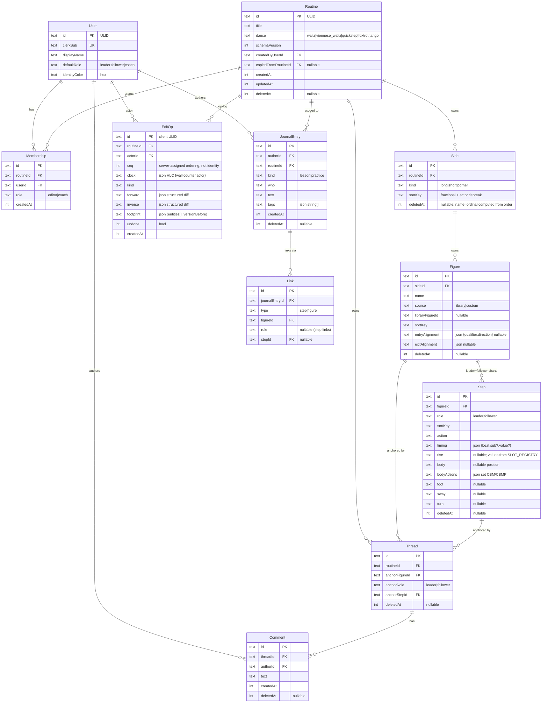
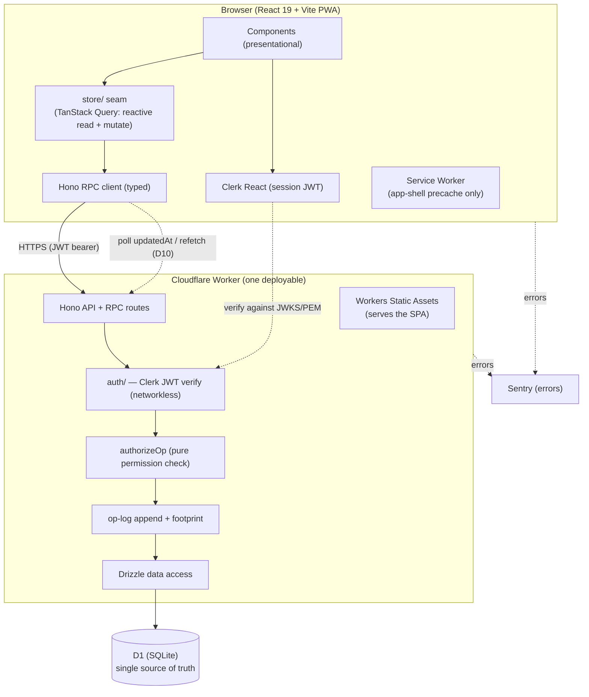
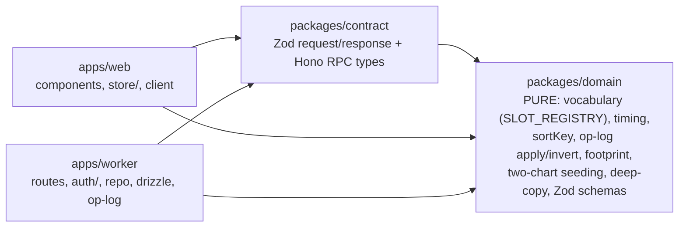
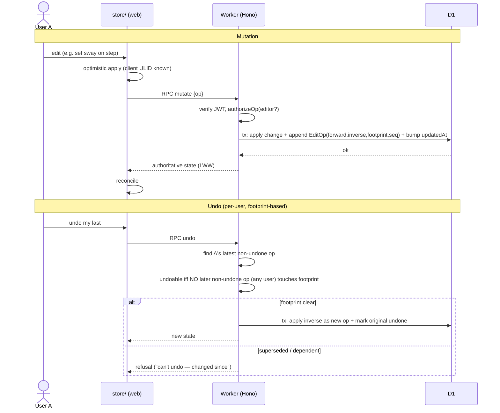

# Ballroom Flow Implementation Plan

> **For agentic workers:** REQUIRED SUB-SKILL: Use superpowers:subagent-driven-development (recommended) or superpowers:executing-plans to implement this plan task-by-task. Steps use checkbox (`- [ ]`) syntax for tracking.

**Goal:** Build a collaborative, mobile-first PWA for notating and annotating ballroom dance choreography, online-only, on a lean Cloudflare stack, with a per-routine op-log that powers per-user undo.

**Architecture:** A client-rendered React SPA talks to a single Cloudflare Worker (Hono) over a typed RPC contract; the Worker is the sole authority, persisting to D1 via Drizzle and appending an op-log entry on every mutation. Server-authoritative last-write-wins; no client merge logic, no CRDT in v1. The data layer is hidden behind a `store/` seam so a future offline/CRDT engine can replace it without touching UI or domain code.

**Tech Stack:** TypeScript (strict) · React 19 + Vite + vite-plugin-pwa · Hono on Cloudflare Workers (Workers Static Assets) · D1 + Drizzle · Clerk auth · Zod · TanStack Query · ULID ids · Vitest + @cloudflare/vitest-pool-workers + Vitest browser mode + Playwright + fast-check · Biome · pnpm workspaces · GitHub Actions · Sentry.

> **Source spec:** `docs/superpowers/specs/2026-06-24-ballroom-flow-design.md` (v3). **Testing plan:** `docs/superpowers/specs/2026-06-24-testing-plan.md`. **Open questions:** `docs/superpowers/specs/2026-06-24-open-questions.md`. This plan is the buildable decomposition of that spec.

---

## Locked technical decisions (the "cheap decisions")

These were open or unstated; all are locked here as v1 defaults so implementation never stalls on them. **Override any on review** — none are expensive to change before code exists.

| # | Decision | Choice | Rationale |
|---|---|---|---|
| D1 | Package manager / repo layout | **pnpm workspaces**, light monorepo: `packages/domain`, `packages/contract`, `apps/web`, `apps/worker` | Workspace boundaries *enforce* the spec's module seams (domain can't import worker). Quality/maintainability over a flatter single-package repo. |
| D2 | Lint / format | **Biome** (one tool) | One fast tool vs ESLint+Prettier; less config to maintain solo. |
| D3 | CI | **GitHub Actions** | Free, standard, runs Wrangler/Vitest/Playwright headless. |
| D4 | Deploy / environments | **Wrangler**, Workers Static Assets serving the SPA from the same Worker; **`staging` + `production`** wrangler environments | Spec §7/§8; one deployable unit. |
| D5 | Entity IDs | **ULID** via `ulidx`, generated **client-side**, stored as TEXT PKs | Spec v3; unambiguous optimistic create + offline-create prerequisite. |
| D6 | Client data layer | **TanStack Query** wrapping the `store/` seam | Reactive read + mutate surface that a future CRDT store can also present; components never import the RPC client directly. |
| D7 | Validation / contract | **Zod** schemas in `packages/contract`, consumed by Hono RPC + client | One shared source for runtime + compile-time contract. |
| D8 | ORM / migrations | **Drizzle ORM** + **drizzle-kit** migrations; tests use `applyD1Migrations()` | Spec §7/§9. |
| D9 | Auth boundary | **Clerk**, isolated behind a thin `apps/worker/src/auth/` module (verify JWT via `@clerk/backend`, map `sub`→`User`) | Resolves **Q-A1**: keep lock-in contained so a later swap (Better-Auth) touches one module. |
| D10 | Live refresh | **Polling / stale-while-revalidate** via TanStack Query (refetch on focus + interval) + manual pull-to-refresh; **SSE deferred** | Resolves **Q-S1**: zero extra infra; near-real-time is a nice-to-have, not correctness. |
| D11 | Coach edits tags? | **No — comment-only** | Resolves **Q-D6** (default). Worker permission check + UI both gate on `editor`. Flippable later (it's one `authorizeOp` rule). |
| D12 | Save-a-copy carries comments/journal? | **No — fresh artifact** (structure + both charts + tags + alignment only) | Resolves **Q-D5** (default). |
| D13 | Undo granularity (Q-S2) | Coalesce same-field edits within **~1s** into one op; a compound create (figure + its seeded steps) undoes as **one** op; a single reorder is **one** op | Recorded spec default; pins op-log boundaries. |
| D14 | Identity-color collisions | **Tolerated**; warn within a routine; **initials are the primary identity signal**, color secondary | Resolves **Q-A2**; consistent with a11y (color never sole signal). |
| D15 | Error monitoring | **Sentry** free tier (browser SDK in `apps/web` + `@sentry/cloudflare` in the Worker); Tail Workers as the zero-setup fallback | Spec §8 ops baseline. |
| D16 | Node / tooling versions | **Node 22 LTS**, pnpm 9, TypeScript strict, `"type": "module"` everywhere | Stable floor; pinned in `.nvmrc` + `packageManager`. |

**Still genuinely open (does NOT block the build):**
- **★ Q-D4 — Body position + body-action vocabulary** (pending the owner's coach; "CBP"→CBMP). The `SLOT_REGISTRY` *mechanism* is built in M1 with the body slot's values as a clearly-marked `[confirm]` stub; final values are data, swappable without code change. The only thing waiting on the coach is a config edit.
- Media (Q-M1/2/3) — v1.1, out of scope.
- Latin/American (Q-SC1/2) — v1.1; the `travelling` flag is already in the model.

---

## Global Constraints

Every task implicitly inherits these (copied from the spec):

- **TypeScript strict** everywhere; no `any` without a written justification.
- **Cloudflare-only** runtime: Worker (Hono) + D1 + Workers Static Assets. No Durable Objects, no WebSockets, no R2 in v1.
- **Online-only.** No client data store, no offline writes, no CRDT. The service worker precaches the **app shell only** and shows an explicit offline state for data.
- **All entity ids are client-generated ULIDs**, TEXT primary keys. **No autoincrement.**
- **Soft-delete only:** deletable rows carry `deletedAt`; deletes set it and are filtered from normal queries. Never a bare row-drop.
- **Every mutation appends an `EditOp`** (forward + inverse + footprint) and bumps `routine.updatedAt`, in the same D1 transaction as the change.
- **The op-log is not the source of state** — D1 rows are. No replay-on-load.
- **Technique vocabulary lives only in the `SLOT_REGISTRY`** (`packages/domain/src/vocabulary.ts`); editor, Lanes, Info-sheet, chips, and Zod all derive from it. No `hasRiseFall` boolean.
- **The client accesses data only through `store/`**; components never import the Hono RPC client.
- **Cost ceiling ~$0/mo** at hobby scale; **index every query**, guarded by an `EXPLAIN QUERY PLAN` CI check.
- **Accessibility WCAG AA:** color never the sole signal; touch targets ≥ 44px; keyboard/SR navigable; reduced-motion respected.

---

## Data Model



> **Reference data (ships in the client bundle, not D1):** `Dance` metadata (`timeSignature`, `beatsPerBar`, `phraseBeats`, `travelling`, display color), the `LibraryFigure` catalog (each carries default leader + follower charts), and the `SLOT_REGISTRY` (technique vocabularies). These are versioned by `schemaVersion`.

---

## Architecture



### Module boundaries (enforced by pnpm workspaces)



`domain` depends on nothing (no I/O) → fully unit-testable. `contract` depends only on `domain`. Both `web` and `worker` depend on `contract` + `domain`, never on each other.

### Mutation + undo flow



---

## File Structure

```
ballroom-flow/
├── pnpm-workspace.yaml
├── biome.json
├── .nvmrc                      # 22
├── packages/
│   ├── domain/                 # PURE, no I/O
│   │   └── src/
│   │       ├── ids.ts          # ULID generation
│   │       ├── vocabulary.ts   # SLOT_REGISTRY (single source of truth)
│   │       ├── dances.ts       # Dance metadata (meter, phraseBeats, travelling)
│   │       ├── timing.ts       # beat→bar derivation (ceil(maxBeat/beatsPerBar))
│   │       ├── sortkey.ts      # fractional index + actor tiebreak
│   │       ├── oplog.ts        # op registry, apply/invert, footprint, undoability
│   │       ├── seeding.ts      # two-chart follower-from-leader pre-fill
│   │       ├── copy.ts         # deep save-a-copy
│   │       └── schemas.ts      # Zod entity schemas (derive enums from vocabulary)
│   └── contract/
│       └── src/index.ts        # Zod request/response + AppType (Hono RPC)
├── apps/
│   ├── worker/
│   │   ├── wrangler.toml       # staging + production envs, D1 binding, assets
│   │   ├── drizzle.config.ts
│   │   ├── migrations/         # drizzle-kit SQL
│   │   └── src/
│   │       ├── index.ts        # Hono app, mounts routes, serves assets
│   │       ├── auth/index.ts   # Clerk verify, sub→User
│   │       ├── db/schema.ts    # Drizzle tables (mirror data model)
│   │       ├── repo/           # data access per aggregate (routine, figure, ...)
│   │       ├── permissions.ts  # authorizeOp (pure)
│   │       ├── oplog.ts        # append + undo endpoint logic
│   │       └── routes/         # routine, side, figure, step, thread, journal, share, undo, export
│   └── web/
│       ├── vite.config.ts      # + vite-plugin-pwa, vitest projects
│       ├── playwright.config.ts
│       └── src/
│           ├── main.tsx, App.tsx, ClerkProvider
│           ├── store/          # the seam: typed read (useX) + mutate hooks over RPC
│           ├── components/     # one folder per screen (List, Assemble, Figure, Step, Thread, Share, Journal, Entry, Profile) + overlays
│           ├── lib/            # rpc client (imported ONLY by store/), sentry
│           └── sw.ts
└── .github/workflows/ci.yml
```

---

## Milestone Roadmap

The plan is **phased**: M0–M1 are fully detailed below (the walking skeleton that proves the notation + op-log model). M2–M9 are scoped with deliverables and the tasks they contain; **each will be expanded into its own detailed plan when reached** (per the writing-plans scope-check) because later milestones depend on what M1 teaches and on the Q-D4 vocabulary. Undo is **kept in v1** (owner decision) but sequenced *after* the notation core proves out (M4), so the riskiest subsystem builds on a verified foundation.

| M | Milestone | Deliverable (working, testable) | Detail |
|---|---|---|---|
| **0** | **Foundation** | Monorepo boots; `domain` + `contract` packages; CI green; a Worker serving a "hello" SPA with a verified Clerk session and an empty D1 migration applied | **Detailed below** |
| **1** | **Domain core (walking skeleton)** | Pure `domain/`: SLOT_REGISTRY, dances, timing, sortKey, two-chart seeding, op-log apply/invert + footprint undoability, deep-copy — all under unit + property tests, **no I/O** | **Detailed below** |
| **2** | Persistence + notation CRUD | Drizzle schema + migrations; repo + Hono routes to create a routine, add sides/figures (instantiating both charts from the library), add/edit/remove/reorder steps, set tags — each appends an EditOp; `store/` seam + the Assemble/Figure/Step screens render and edit it | outline |
| **3** | Auth, membership & permissions | Clerk onboarding (displayName/role/color); Membership + `authorizeOp` (editor vs coach); invite-by-link issue/redeem; Share screen | outline |
| **4** | Undo / redo (the kept-complexity milestone) | Undo + redo endpoints over the op-log using footprint undoability; per-user; "Undone" toast; refusal UX; full property + cross-user + cascade tests | outline |
| **5** | Collaboration: threads & comments | Role-anchored threads, shared comments, identity colors, polling refresh (D10) | outline |
| **6** | Journal & links | Journal list/editor, step + figure links (Link Picker), filter chips incl. by-figure | outline |
| **7** | Lanes view + sample/template + search | Lanes fast-tagging (registry-derived), seed sample routine + start-from-template, routine search | outline |
| **8** | Export / import + ops | schemaVersion'd JSON export AND import (round-trip), Sentry wiring, EXPLAIN-QUERY-PLAN CI gate, staging/prod | outline |
| **9** | PWA + a11y + cross-browser hardening | Installable app shell, offline-state, axe/keyboard/reduced-motion, iOS Safari + Android Chrome E2E | outline |

---

## Task Detail — Milestone 0: Foundation

### Task 0.1: Initialize the monorepo

**Files:**
- Create: `pnpm-workspace.yaml`, `package.json`, `.nvmrc`, `biome.json`, `tsconfig.base.json`, `.gitignore`

**Interfaces:**
- Produces: pnpm workspace recognizing `packages/*` and `apps/*`; `pnpm -r build` runs.

- [ ] **Step 1: Create workspace + root config**

`pnpm-workspace.yaml`:
```yaml
packages:
  - "packages/*"
  - "apps/*"
```
`.nvmrc`: `22`. Root `package.json` sets `"packageManager": "pnpm@9", "type": "module"` and scripts `build`, `test`, `lint`, `typecheck` delegating with `pnpm -r`.

- [ ] **Step 2: Add Biome + base tsconfig**

`biome.json` enables formatter + linter (recommended ruleset, `noExplicitAny: error`). `tsconfig.base.json` sets `"strict": true, "moduleResolution": "Bundler", "target": "ES2022", "verbatimModuleSyntax": true`.

- [ ] **Step 3: Add a `.gitignore`**

Ignore `node_modules`, `dist`, `.wrangler`, `.dev.vars`, `coverage`, `playwright-report`, `test-results`.

- [ ] **Step 4: Install & verify**

Run: `pnpm install && pnpm biome check .`
Expected: install succeeds; Biome reports no errors on the (empty) tree.

- [ ] **Step 5: Commit**
```bash
git add -A && git commit -m "chore: initialize pnpm monorepo with Biome + strict TS"
```

### Task 0.2: Scaffold the `domain` and `contract` packages

**Files:**
- Create: `packages/domain/package.json`, `packages/domain/tsconfig.json`, `packages/domain/vitest.config.ts`, `packages/domain/src/index.ts`
- Create: `packages/contract/package.json`, `packages/contract/tsconfig.json`, `packages/contract/src/index.ts`

**Interfaces:**
- Produces: `@ballroom/domain` and `@ballroom/contract` importable workspace packages; `vitest` runs in `domain` (zero tests = green).

- [ ] **Step 1: Create `@ballroom/domain`** with `"main": "src/index.ts"`, deps `zod`, `ulidx`; dev dep `vitest`, `fast-check`. `src/index.ts` re-exports submodules (empty for now). `vitest.config.ts` uses the node environment.

- [ ] **Step 2: Create `@ballroom/contract`** depending on `@ballroom/domain` + `zod`; `src/index.ts` exports an empty `z.object` placeholder.

- [ ] **Step 3: Verify** — Run: `pnpm --filter @ballroom/domain test` → Expected: "no test files" / exit 0; `pnpm -r typecheck` passes.

- [ ] **Step 4: Commit** — `git add -A && git commit -m "chore: scaffold domain + contract packages"`

### Task 0.3: Scaffold the Worker (Hono + assets + empty D1)

**Files:**
- Create: `apps/worker/package.json`, `wrangler.toml`, `drizzle.config.ts`, `src/index.ts`, `migrations/0000_init.sql` (empty marker), `src/db/schema.ts` (empty)

**Interfaces:**
- Produces: `wrangler dev` serves a Hono app with `GET /api/health` → `{ok:true}` and serves static assets; a `DB` D1 binding exists.

- [ ] **Step 1: Add Hono + Wrangler config** with `staging` and `production` environments, a `DB` D1 binding, and `assets = { directory = "../web/dist", not_found_handling = "single-page-application" }`.

- [ ] **Step 2: Minimal Hono app** — `src/index.ts` exports a Hono app with `app.get("/api/health", c => c.json({ ok: true }))`.

- [ ] **Step 3: Write the failing health test** (`@cloudflare/vitest-pool-workers`):
```ts
import { env, SELF } from "cloudflare:test";
import { it, expect } from "vitest";
it("health endpoint responds", async () => {
  const res = await SELF.fetch("https://x/api/health");
  expect(await res.json()).toEqual({ ok: true });
});
```
- [ ] **Step 4: Run it** — Run: `pnpm --filter worker test` → Expected: PASS.
- [ ] **Step 5: Commit** — `git commit -am "feat(worker): Hono health endpoint + D1 binding + SPA assets"`

### Task 0.4: Scaffold the web SPA + Clerk + a verified call

**Files:**
- Create: `apps/web/package.json`, `vite.config.ts`, `index.html`, `src/main.tsx`, `src/App.tsx`, `src/lib/rpc.ts`, `apps/worker/src/auth/index.ts`

**Interfaces:**
- Consumes: Worker `/api/health`.
- Produces: a SPA gated by Clerk that calls an authenticated `/api/me` returning the verified user; the Worker's `auth/` verifies the Clerk JWT networklessly.

- [ ] **Step 1: Vite + React + Clerk** — `App.tsx` wraps routes in `<ClerkProvider>`; signed-out shows sign-in, signed-in calls `/api/me`.
- [ ] **Step 2: Worker `auth/`** — verify `Authorization: Bearer` via `@clerk/backend` against the configured JWKS; add `GET /api/me` returning `{ sub }`. (User-row mapping lands in M3.)
- [ ] **Step 3: Failing integration test** — mint a test JWT, assert `/api/me` returns the `sub`; assert a missing/invalid token → 401.
- [ ] **Step 4: Run** — `pnpm --filter worker test` → Expected: PASS.
- [ ] **Step 5: Commit** — `git commit -am "feat: Clerk-gated SPA + networkless JWT verify on the Worker"`

### Task 0.5: CI pipeline

**Files:** Create `.github/workflows/ci.yml`

- [ ] **Step 1:** Workflow on PR + main: setup pnpm + Node 22, `pnpm install --frozen-lockfile`, `pnpm biome check .`, `pnpm -r typecheck`, `pnpm -r test`. (Playwright + EXPLAIN-QUERY-PLAN jobs added in M8/M9.)
- [ ] **Step 2:** Push a branch, open a PR, confirm CI green.
- [ ] **Step 3: Commit** — `git commit -am "ci: lint + typecheck + unit/integration tests on PR"`

**M0 exit criteria:** repo boots; CI green; a signed-in user round-trips a verified call to the Worker; D1 binding present. The stack is proven end-to-end with zero domain logic.

---

## Task Detail — Milestone 1: Domain Core (walking skeleton)

All M1 work is in `packages/domain` — pure, no I/O, fast unit + property tests. This proves the *notation and op-log model* before any persistence or UI exists. TDD throughout.

### Task 1.1: ULID ids

**Files:** Create `packages/domain/src/ids.ts`, `packages/domain/src/ids.test.ts`

**Interfaces:**
- Produces: `newId(): string` (26-char ULID), `isId(s: string): boolean`.

- [ ] **Step 1: Failing test**
```ts
import { newId, isId } from "./ids";
import { it, expect } from "vitest";
it("mints sortable unique ULIDs", () => {
  const a = newId(), b = newId();
  expect(isId(a)).toBe(true);
  expect(a).toHaveLength(26);
  expect(a).not.toEqual(b);
});
```
- [ ] **Step 2: Run → FAIL** (`newId` not defined). Run: `pnpm --filter @ballroom/domain test ids`
- [ ] **Step 3: Implement** — wrap `ulidx`: `export const newId = () => ulid(); export const isId = (s:string) => /^[0-9A-HJKMNP-TV-Z]{26}$/.test(s);`
- [ ] **Step 4: Run → PASS.**
- [ ] **Step 5: Commit** — `git commit -am "feat(domain): ULID ids"`

### Task 1.2: Dance metadata

**Files:** Create `packages/domain/src/dances.ts` + test

**Interfaces:**
- Produces: `DANCES: Record<DanceId, {label,timeSignature,beatsPerBar,phraseBeats,travelling,color}>`, `DanceId = "waltz"|"viennese_waltz"|"quickstep"|"foxtrot"|"tango"`.

- [ ] **Step 1: Failing test** — assert `DANCES.waltz.beatsPerBar===3 && phraseBeats===6`; `DANCES.foxtrot.beatsPerBar===4 && phraseBeats===8`; every dance `travelling===true`.
- [ ] **Step 2: Run → FAIL.**
- [ ] **Step 3: Implement** the table (Waltz/Viennese 3/4 phraseBeats 6; Foxtrot/Quickstep/Tango 4/4 phraseBeats 8; colors per spec §3.6).
- [ ] **Step 4: Run → PASS.**  **Step 5: Commit** — `git commit -am "feat(domain): dance metadata"`

### Task 1.3: SLOT_REGISTRY (single source of truth)

**Files:** Create `packages/domain/src/vocabulary.ts` + test

**Interfaces:**
- Produces: `SLOT_REGISTRY: SlotDef[]` where `SlotDef = { key, label, color, cardinality:"single"|"multi", values:{value,label}[], appliesToDances:DanceId[], appliesToRoles:("leader"|"follower")[], storage:"column" }`; helpers `slotsForDance(d)`, `valuesFor(slotKey)`, `isKnownValue(slotKey,v)`, `REGISTRY_VERSION`, `VALUE_ALIASES` (e.g. `CBP→CBMP`).

- [ ] **Step 1: Failing test** — `slotsForDance("tango")` excludes `rise` (replaces `hasRiseFall`); `foot` values include `H`; `turn` includes `eighth_L`; `rise` includes `NFR`; `body` cardinality `single` and a separate `bodyActions` slot cardinality `multi`; `valuesFor` for an unknown value resolves via `VALUE_ALIASES` (`CBP`→`CBMP`); body slot values carry a `[confirm]` flag (Q-D4 stub).
- [ ] **Step 2: Run → FAIL.**
- [ ] **Step 3: Implement** the registry per spec §3 (rise/body/bodyActions/foot/sway/turn), `appliesToDances` encoding Tango-no-rise, confirmed additions H/⅛/NFR, alias map, version constant. Mark body/position values `confirm:true`.
- [ ] **Step 4: Run → PASS.**  **Step 5: Commit** — `git commit -am "feat(domain): SLOT_REGISTRY vocabulary source of truth"`

### Task 1.4: Zod schemas derived from the registry

**Files:** Create `packages/domain/src/schemas.ts` + test

**Interfaces:**
- Produces: Zod schemas `zStep`, `zFigure`, `zSide`, `zRoutine`, `zTiming`, etc. The per-slot enums are **built from `SLOT_REGISTRY`**, not hardcoded. Unknown enum values **pass through** (lenient read) but `validateStrict` rejects them.

- [ ] **Step 1: Failing test** — `zStep.parse` accepts a step with `turn:"eighth_L"`; a Tango step with a `rise` value fails `validateStrict` (rise not applicable); an unknown `foot` value passes lenient parse but fails strict; `zTiming` accepts `{beat:3, sub:"&"}` and rejects `beat:9` for a 4/4 phrase.
- [ ] **Step 2: Run → FAIL.**
- [ ] **Step 3: Implement** schemas that read `SLOT_REGISTRY`/`DANCES`; lenient vs strict variants; timing bounds from `phraseBeats`.
- [ ] **Step 4: Run → PASS.**  **Step 5: Commit** — `git commit -am "feat(domain): registry-derived Zod schemas"`

### Task 1.5: Timing → bar derivation

**Files:** Create `packages/domain/src/timing.ts` + test

**Interfaces:**
- Produces: `barsForChart(steps: {timing}[], dance): number` = `ceil(maxBeat / beatsPerBar)`; `barLabel(routineSteps, dance)`; handles charts of **different lengths per role**.

- [ ] **Step 1: Failing test** — a Waltz chart with max beat 6 → 2 bars; max beat 4 → 2 bars (`ceil(4/3)`); a Foxtrot chart max beat 8 → 2 bars; leader chart (5 steps) and follower chart (6 steps) derive independently; partial final bar shown as-is.
- [ ] **Step 2: Run → FAIL.**
- [ ] **Step 3: Implement** `ceil(maxBeat/beatsPerBar)` per role.
- [ ] **Step 4: Run → PASS.**  **Step 5: Commit** — `git commit -am "feat(domain): meter-based per-role bar derivation"`

### Task 1.6: Fractional sort keys

**Files:** Create `packages/domain/src/sortkey.ts` + test

**Interfaces:**
- Produces: `keyBetween(a: string|null, b: string|null, actorId: string): string` (fractional index with actor-id tiebreak appended); ordering is lexicographic.

- [ ] **Step 1: Failing test** — `keyBetween(null,null,act)` then inserting between two keys yields a key strictly between them; repeated inserts at the same gap with **different actorIds** stay distinct and ordered; 50 sequential inserts remain strictly increasing without rebalancing.
- [ ] **Step 2: Run → FAIL.**
- [ ] **Step 3: Implement** a generous-space fractional index (e.g. base-62 midpoint) + `#${actorId}` tiebreak suffix.
- [ ] **Step 4: Run → PASS.**  **Step 5: Commit** — `git commit -am "feat(domain): fractional sort keys with actor tiebreak"`

### Task 1.7: Two-chart pre-fill seeding

**Files:** Create `packages/domain/src/seeding.ts` + test

**Interfaces:**
- Produces: `seedFollowerFromLeader(leaderSteps: Step[]): Step[]` — copies leader values into new follower steps (new ids), a **one-time** seed; subsequent edits are independent.

- [ ] **Step 1: Failing test** — seeded follower steps equal leader values but have distinct ids and `role:"follower"`; mutating a returned follower step does not change the leader array (independence).
- [ ] **Step 2: Run → FAIL.**  **Step 3: Implement.**  **Step 4: Run → PASS.**
- [ ] **Step 5: Commit** — `git commit -am "feat(domain): two-chart follower seeding"`

### Task 1.8: Op registry + apply/invert

**Files:** Create `packages/domain/src/oplog.ts` + test

**Interfaces:**
- Produces: `OP_REGISTRY` mapping `kind → { apply(state, forward), invert(forward, before): inverse, footprintOf(forward, before): Footprint }`; `applyOp(state, op)`, `invertOp(op)`. Op kinds for M1: `step.setSlot`, `step.setTiming`, `step.add`, `step.remove`, `figure.add` (compound: figure + seeded steps = one op), `figure.remove`, `side.add`, `side.reorder`. `Footprint = { entities: string[]; versionBefore: Record<string, number> }`.

- [ ] **Step 1: Failing test (round-trip)** — for a representative op of each kind, `applyOp(applyOp(s, op).then invert)` restores `s` exactly (deep-equal). `figure.add` undoes the figure **and** its seeded steps as one op. `footprintOf` lists every touched entity id.
- [ ] **Step 2: Run → FAIL.**
- [ ] **Step 3: Implement** the registry with structured forward/inverse diffs (entityType+id+field+before/after) and footprint computation.
- [ ] **Step 4: Run → PASS.**  **Step 5: Commit** — `git commit -am "feat(domain): op registry, apply/invert, footprint"`

### Task 1.9: Property-based op invertibility

**Files:** Create `packages/domain/src/oplog.property.test.ts`

- [ ] **Step 1: Failing property test (fast-check)** — generate random valid op sequences over a model state; assert `invert(apply)` round-trips for **every** generated op of every registered kind (auto-covers future kinds). 
- [ ] **Step 2: Run → FAIL/iterate** until the generators + invariants hold.
- [ ] **Step 3: Commit** — `git commit -am "test(domain): property-based op invertibility"`

### Task 1.10: Footprint-based undoability

**Files:** Add to `packages/domain/src/oplog.ts`; create `oplog.undo.test.ts`

**Interfaces:**
- Produces: `isUndoable(target: EditOp, laterOps: EditOp[]): { ok: true } | { ok: false; reason: "superseded"|"dependent" }` — undoable iff **no later non-undone op (any actor) touches any entity in `target.footprint`**; `latestUndoableForUser(ops, userId)`; redo cursor helper `nextRedoForUser(ops, userId)`.

- [ ] **Step 1: Failing tests** — (a) field edit then nothing later → undoable (reduces to "changed since"); (b) A edits a field, A edits it again → undo of the first is `superseded`; (c) A adds a figure, B tags a step inside it → A's undo-of-add is `dependent` (B's op in footprint); (d) cascade: figure.remove footprint includes its steps/threads/links; (e) redo cursor re-targets the just-undone op and is cleared by a new edit.
- [ ] **Step 2: Run → FAIL.**  **Step 3: Implement** the footprint-intersection rule + cursors.
- [ ] **Step 4: Run → PASS.**  **Step 5: Commit** — `git commit -am "feat(domain): footprint-based undoability + redo cursor"`

### Task 1.11: Deep copy (save-a-copy)

**Files:** Create `packages/domain/src/copy.ts` + test

**Interfaces:**
- Produces: `deepCopyRoutine(routine, byUserId): Routine` — copies sides/figures/**both charts**/tags/alignment with **new ids**, sets `copiedFromRoutineId`, **omits comments/journal** (D12).

- [ ] **Step 1: Failing test** — copy has new ids throughout, both charts preserved, alignment preserved, `copiedFromRoutineId` set, no threads/journal carried.
- [ ] **Step 2: Run → FAIL.**  **Step 3: Implement.**  **Step 4: Run → PASS.**
- [ ] **Step 5: Commit** — `git commit -am "feat(domain): deep copy for save-a-copy"`

**M1 exit criteria:** every domain rule the app depends on — vocabulary, timing/bars, ordering, two-chart seeding, op apply/invert, footprint undoability, deep copy — is implemented and covered by unit + property tests, with zero I/O. This is the walking skeleton's proof that the notation + undo model is sound before a single row is persisted.

---

## Milestones 2–9 (outline — each becomes its own detailed plan)

> These are intentionally not yet expanded to bite-sized steps: M2+ depend on what M1 surfaces and on the Q-D4 vocabulary, and the writing-plans scope-check favors one detailed plan per subsystem. Each lists its deliverable, the files it touches, and the task set it will contain.

- **M2 — Persistence + notation CRUD.** `apps/worker/src/db/schema.ts` (Drizzle tables mirroring the data model, all soft-delete + ULID PKs), drizzle-kit migrations, `repo/` per aggregate, Hono routes (routine/side/figure/step/tag), the `oplog.ts` append-in-transaction, the `store/` seam + Assemble/Figure/Step screens. Tasks: schema + migration; routine create; figure-add instantiates both charts from a library fixture; step add/edit/remove/reorder; tag set; each mutation appends an EditOp; `store/` read+mutate hooks; the three screens render/edit. Integration tests via vitest-pool-workers; component tests; the core authoring E2E.
- **M3 — Auth, membership & permissions.** `User` row mapping, onboarding (displayName/role/color), `Membership`, `permissions.ts` `authorizeOp` (pure; coach = comment-only per D11), invite-link issue/redeem, Share screen. Tests: authorizeOp truth table (unit), route-level permission enforcement + forged-request rejection (integration/E2E), invite issue→redeem→expired.
- **M4 — Undo / redo.** Worker undo + redo endpoints over the op-log using `isUndoable`; "Undone"/refusal toasts; per-user cursors. Tests: cascade-delete-then-undo restores subtree; cross-user dangling refusal; redo cursor; per-user interleaving — at integration + E2E (the domain logic is already proven in M1).
- **M5 — Threads & comments.** Role-anchored threads, shared comments, identity colors, polling refresh (D10). Tests: anchor integrity to a role's step; comment author-color; coach may comment; LWW on a comment field.
- **M6 — Journal & links.** Journal list/editor, step + figure links + Link Picker, filter chips incl. by-figure. Tests: link to step (role-specific) and figure; filter; link survives.
- **M7 — Lanes + sample/template + search.** Registry-derived Lanes fast-tagging; seed sample routine + start-from-template; routine search. Tests: Lanes sets a dimension across steps; sample routine renders read-only; search by title/dance.
- **M8 — Export / import + ops.** schemaVersion'd JSON export AND import (round-trip + migration-ladder stub), Sentry, EXPLAIN-QUERY-PLAN CI gate, staging/prod deploy. Tests: round-trip; older-version import migrates; query-plan uses indexes.
- **M9 — PWA + a11y + cross-browser.** Installable shell + offline-state, axe/keyboard/reduced-motion, iOS Safari + Android Chrome E2E. Tests: install/app-shell-offline; axe clean; keyboard nav.

---

## Self-Review

- **Spec coverage:** Every spec §2 entity appears in the data model + M2 schema. §3 vocabularies → M1.3/1.4. §4 screens → M2/M5/M6/M7. §5 collaboration/undo → M3/M4. §6 media is correctly out of scope (v1.1). §7 architecture → diagrams + file structure + M0. §8 NFR/ops → M8/M9 + global constraints. §9 testing → folded into each milestone, matching the standalone testing plan. §11 open questions → resolved in Locked Decisions except Q-D4 (explicitly a non-blocking config stub).
- **Placeholder scan:** M0–M1 steps contain concrete code/commands/expected output. M2–M9 are deliberately outlined (not placeholdered) per the phased-plan scope-check, each with deliverable + files + task set; they convert to detailed plans on arrival.
- **Type consistency:** `newId`, `SLOT_REGISTRY`/`slotsForDance`, `barsForChart`, `keyBetween`, `seedFollowerFromLeader`, `OP_REGISTRY`/`applyOp`/`invertOp`/`footprintOf`, `isUndoable`/`latestUndoableForUser`, `deepCopyRoutine` are used consistently between their defining tasks and the milestone outlines that consume them.

---

*End of plan. M0–M1 are execution-ready; M2–M9 expand into their own plans as reached.*
